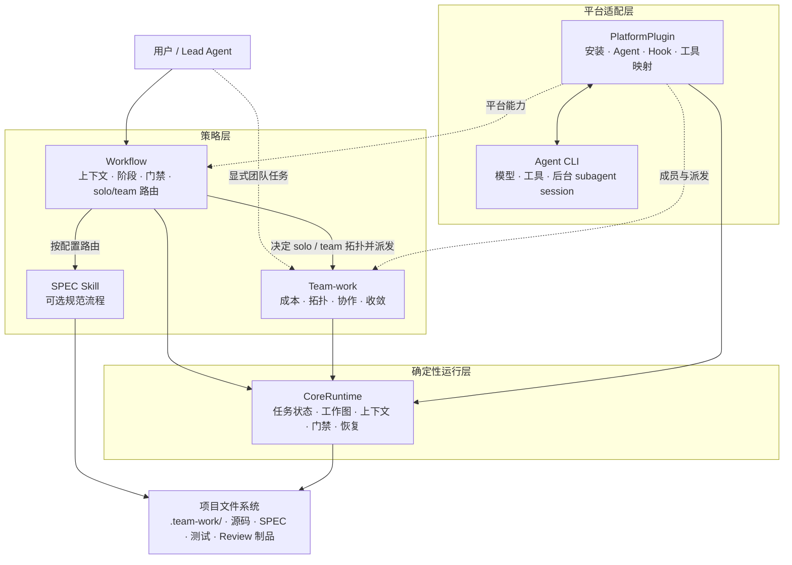
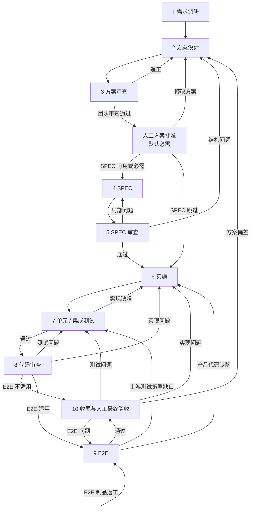
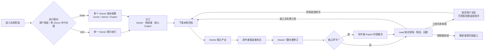

# team-work-runtime

## 简介

team-work-runtime 是平台无关的 multiagent engineering loop。Lead Agent 只管理研发阶段、上下文、成本、派发、制品、证据与门禁，不承担具体工作或技术内容裁决；具体产出由 Owner 完成，挑战者复核，核心环节由 Expert 裁决。

仓库与 npm 包名使用 `team-work-runtime`；`/team-work` Skill、`team-work` CLI 和项目内 `.team-work/` 状态目录作为稳定用户协议继续保留。

团队按 [Junior、Senior、Expert](#成本控制与团队分档) 三档控制成本。Junior 承担主要工作，Senior 负责复杂判断与挑战，Expert 用于高风险把关、关键攻坚或最终收口。



Workflow 和 Team-work 提供研发与协作策略；CoreRuntime 通过稳定接口固化状态、工作图、门禁与恢复，只依赖项目文件系统和平台执行接口。PlatformPlugin 接入不同 CLI 的模型、工具和 multiagent 能力。首版支持 OpenCode。

## QuickStart

需要 Node.js 18+ 和 OpenCode 1.18.0+。安装是用户级操作，可在任意目录执行：

```bash
npx team-work-runtime@latest install
```

安装器会将 Server 入口写入 OpenCode 全局插件目录，并在全局 `tui.json` 中注册 Team 侧栏；不会修改 Provider、网关或 `opencode.json`。如果 OpenCode 已经运行，请在安装完成后重启。

安装器会创建用户配置。Linux 与 macOS 默认位置为：

```text
~/.config/team-work/config.json
```

Windows 默认使用 `%APPDATA%\team-work\config.json`。设置 `TEAM_WORK_CONFIG_HOME` 可直接指定目录；设置 `XDG_CONFIG_HOME` 时使用 `$XDG_CONFIG_HOME/team-work/config.json`。

进入项目并启动 OpenCode：

```bash
cd /path/to/project
opencode
```

启动完整研发任务：

```text
/workflow 实现这个需求；从实际阶段介入，并根据是否需要多个 Owner 并行决定 solo 或 team。
```

只使用团队能力：

```text
/team-work 审查 src/imap/；安排非作者挑战者，最多三轮收敛并输出 Review 制品。
```

首次调用时，插件会在当前项目创建 `.team-work/`。用户级安装不会提前修改项目目录。

## 使用说明

### 完整研发任务

使用 `/workflow` 创建或恢复任务、选择介入阶段和管理门禁。所有具体工作均通过 Team-work 派发给成员；SPEC 阶段再按配置路由 SPEC Skill。

```text
/workflow 复用已有设计和代码，从 implementation 阶段继续，完成实现、测试、代码审查和收尾。
```

### 单独使用团队能力

使用 `/team-work` 处理方案讨论、设计审查、并行实施、测试或代码 Review。它会建立当前场景所需的轻量任务，不要求补跑完整流程。

```text
/team-work 对当前方案进行团队审查。每轮都由挑战者检查事实、推理、成本和需求偏移。
```

### 从已有制品介入

任务可从任意阶段开始。只有代码时可进入 `code-review`；已有方案可进入 `design-review`；需要补测试时可进入 `test`。门禁只检查当前阶段的最低输入。

### 查看或继续任务

```text
/workflow 汇报当前任务的阶段、成员、制品、阻塞和下一步，不要启动新成员。
```

跨会话时优先提供 task ID。不知道时由 Workflow 解析会话绑定或项目唯一活动任务。状态与制品索引保存在项目 `.team-work/` 中。

## 成本控制与团队分档

档位只表示模型能力上限与相对成本，不限制具体研发分工。`solo` 是单一 Owner 串行执行，不是 Lead 亲自执行；`team` 才允许多个 Owner 并行。两种拓扑都需要非作者挑战者，核心环节需要非作者 Expert 作内容裁决或把关。

| 档位 | 默认成本权重 | 主要用途 | 使用原则 |
| --- | ---: | --- | --- |
| Junior | 1 | 事实探索、常规实现、测试、第一轮审查 | 默认主力，通常参与正式团队 |
| Senior | 10 | 跨模块判断、高风险实现、独立方案、挑战者 | 多数正式场景配置一位 |
| Expert | 50 | 架构把关、关键攻坚、复杂重构、最终收口 | 复杂场景通常保留一位，不机械增员 |

默认成员池：

- Junior：`junior-flash`、`junior-luna`
- Senior：`senior-terra`、`senior-glm`、`senior-qwen`
- Expert：`expert-opus`、`expert-k3`

同档多成员优先选择不同模型。挑战者通常由 Senior 或 Expert 兼任；Expert 既可把关，也可亲自承担复杂核心工作，但不能裁决本人制品。

成员需要并行检索时，可调用两个临时只读助手：`team-work-explore` 负责代码探索，`team-work-librarian` 负责外部资料。它们共用一个 `assistant` 角色绑定（未配置时回退 junior 成员），不占 Junior/Senior/Expert 席位，也不承担制品、挑战或裁决责任；调用成员负责核验并整合结果。

活跃成员软上限为 3–5 人，不含 Lead。第二位 Expert 只用于不可逆决策、关键证据冲突、重复验证失败、领域盲区，或用户明确要求的场景。

## 工作流

### 十阶段研发循环

任务可以从任意阶段介入。SPEC 和 E2E 都有明确的跳过条件；返工按问题归因返回真正负责的阶段。



| 阶段 | 核心工作与典型制品 |
| --- | --- |
| 1. 需求调研 | 需求、架构、代码地图、外部事实、约束与未知项 |
| 2. 方案设计 | 方案、权衡、风险、实施拆分与验证策略 |
| 3. 方案审查 | 独立审查事实、边界、成本、风险与需求符合度；完成后默认等待人工批准方案 |
| 4–5. SPEC | 可选地生成并审查可实施、可验收的规范 |
| 6. 实施 | 按互斥范围编码，保持既有架构与风格 |
| 7. 测试 | 单元与集成测试，区分实现、测试和基础设施问题 |
| 8. 代码审查 | 覆盖需求、缺陷、安全、错误处理、逻辑、测试、类型、规范和影响范围 |
| 9. E2E | 设计、用例审查、夹具/脚本、实现审查、执行与结果复核 |
| 10. 收尾 | 汇总实际制品和证据，默认等待人工最终验收；通过后才能完成、提交与归档 |

### E2E 小循环

进入 E2E 前必须判断适用性。不适用时记录理由并跳过；适用但环境不可用时阻塞；用户明确要求时不得自动跳过。

```text
测试设计 → 用例审查 → 夹具/脚本实现 → 实现审查 → 执行 → 结果复核
    ↑                                                        │
    └──────────────── E2E 制品修订 ──────────────────────────┘
```

用例、夹具、脚本和执行问题留在 E2E；产品代码缺陷返回实施；只有系统性的上游测试策略缺口返回测试。

### 每个阶段的 Team-work 协作环

Team-work 在研发阶段内部提供团队循环，不建立第二套研发状态机。



挑战者参与每一轮，而不是只做最终签字。Owner 必须独立核验挑战和 Expert 结论，可基于证据接受或提出异议；Lead 不替各方强行裁定技术分歧。下一轮只处理分歧、证据缺口和修正项；三轮是自主循环上限，用户可以明确授权限定目标与预算的追加轮次，也可以换 Expert、接受风险或终止。

Lead 只接收控制面索引，不注入整个任务目录。Owner、挑战者和 Expert 各有独立 work item；同一 work item 的多轮协作复用同一 session，跨阶段、换 Owner、失联或需要独立第二意见时才重建。

默认有两个固定人工门禁：方案团队审查完成后的方案批准，以及任务完成前的最终验收。其他人工介入仍只在用户预先指定、高风险或团队无法自主收敛时触发。Lead 用简短普通回复说明结论、依据、可定位产物、修改影响、分歧/风险和建议，再提出一个明确问题；进入等待前清理外部续跑队列，等待期间不创建后台任务或定时轮询。用户追问技术细节时转交原 Owner、挑战者或 Expert，不自行大量探索或猜测。

方案文档是需求、范围和实现方向的人机唯一批准基线。它必须用朴实语言完整描述修改点及影响；复杂关系使用适宜图表。重大核心逻辑可以引用附文件位置的现有代码片段，但不得臆造代码事实；拟议代码必须明确标注为伪代码或建议实现。批准绑定当前文档指纹，文档变化后必须重新确认。

### OpenSpec 与工作流

[OpenSpec](https://github.com/Fission-AI/OpenSpec) 是默认 SPEC Skill，不是状态存储或多 Agent 调度器。`spec.mode` 控制路由：

- `auto`：OpenSpec ready 时使用，missing 时跳过 SPEC。
- `required`：OpenSpec missing 时阻塞。
- `disabled`：始终跳过 SPEC。

启用后，平台适配器会创建或恢复与 task-id 同名的活动 change。proposal 完成后按照 OpenSpec 实际返回的 `status/instructions` 推进 design/specs，最后生成 tasks；Lead 只选择 artifact 类型和 proposal 已确认的 capability 名称，物理路径由 Harness 生成。Runtime 会拒绝直接修改 canonical specs、archive 或其他 change，OpenSpec 未完成时也不能进入 SPEC 审查。离开 SPEC 后，仅实施阶段允许更新活动 change 的 `tasks.md`；需求或设计变化必须返回 SPEC。实现、测试和最终人工验收完成后，收尾环节才会严格验证并归档该 change。

未使用 OpenSpec 时，Workflow 可根据方案直接进入实施，收尾阶段也只汇总实际存在的制品。未来可通过同一路由接入 Spec Kit 等工具。

## 配置

### 项目工作流配置

首次在项目使用 Workflow 时会生成 `.team-work/config.yaml`。人工审核默认配置为：

```json
{
  "humanReview": {
    "design-approval": "required",
    "final-acceptance": "required"
  }
}
```

`required` 必须等待用户明确决定；`optional` 未发起时可跳过，但发起后必须处理决定；`disabled` 关闭该人工门禁，但不会取消普通制品、测试和证据要求。Agent 不得自行降低模式。

### 用户与模型配置

配置路径按以下顺序解析：

1. `TEAM_WORK_CONFIG_HOME`
2. `XDG_CONFIG_HOME/team-work`
3. Windows `%APPDATA%\team-work`
4. Linux/macOS `~/.config/team-work`

首次安装生成：

```json
{
  "$schema": "./schemas/user-config.v1.schema.json",
  "agents": "auto",
  "platforms": {
    "opencode": {
      "enabled": true
    }
  },
  "spec": {
    "provider": "openspec",
    "mode": "auto"
  }
}
```

安装器会在配置目录生成对应的本地 JSON Schema。需要指定模型和 effort 时，将 `agents` 改为对象；Agent ID 可自由命名，条目通过 `role` 声明职责，`role` 取值 `junior | senior | expert | challenger | assistant`：

```json
{
  "$schema": "./schemas/user-config.v1.schema.json",
  "agents": {
    "junior-ds": {
      "model": "aigw/deepseek-v4-flash",
      "effort": "low",
      "role": "junior"
    },
    "senior-terra": {
      "model": "aigw/gpt-5.6-terra",
      "effort": "high",
      "role": "senior"
    },
    "challenger-ds": {
      "model": "aigw/deepseek-v4-flash",
      "effort": "low",
      "role": "challenger"
    },
    "expert-opus": {
      "model": "official/claude-opus-5",
      "effort": "high",
      "role": "expert"
    },
    "assist-glm": {
      "model": "aigw/glm-5.2",
      "effort": "low",
      "role": "assistant"
    }
  },
  "platforms": {
    "opencode": {
      "enabled": true
    }
  },
  "spec": {
    "provider": "openspec",
    "mode": "auto"
  }
}
```

`model` 必须是 OpenCode 可见的完整 `provider/model`。`effort` 会映射为 Agent 级 `reasoningEffort`；可用值取决于模型、Provider 和网关。

`role` 语义：

- `junior | senior | expert` 是成员基础角色，成本档位按 1:10:50 计；
- `challenger` 是显式挑战者角色，成本档位同 senior；未配置任何 `challenger` 时回退 `senior`；
- `assistant` 绑定两个只读助手 `team-work-explore` 与 `team-work-librarian`，不占成员席位、不承担制品或裁决；未配置时回退第一个 `junior` 成员，仍无 junior 则不注入助手；
- 与内置目录同名（如 `senior-terra`）且省略 `role` 的条目保持“只改模型”的兼容语义；`agents: "auto"` 行为不变；未知 ID 必须声明 `role`，否则安装器给出明确报错。

推荐用模型名作为 ID 前缀（如 `challenger-ds`），便于在派单、事件和 Team 侧栏直接观察每个成员使用的模型。同一任务进行中改配置不会影响已钉住的工作图；能力快照按 Agent 身份钉住，派发时校验。

`platforms.opencode.enabled` 控制 PlatformPlugin 是否注册 Agent、工具、Hook 和 Team 侧栏。修改配置后只需重启 OpenCode。停用期间 `update` 仍会检查并修复安装资产，方便恢复或升级，但不会要求 Agent 已注册。自定义命令可设置 `platforms.opencode.command` 或 `spec.command`。

## OpenCode 平台

Plugin 在 OpenCode 启动时读取用户配置，动态注入 Team-work subagent，并把当前有效 Agent Profile 写入项目上下文。

Lead 只使用四个意图级动作控制 Harness：`workflow_open` 打开或创建任务，`workflow_plan` 提交当前阶段目标、执行偏好、预算和风险，`workflow_run` 按持久状态继续，`workflow_steer` 提交选项、解释、返工、补证据、追加挑战、Expert 意见、更换 Owner、重规划或升级用户等受控意图。成员用独立的 `team_work_report` 交付。工作图、派发、续派、等待、门禁、revision、session ID、SPEC 命令及路径选择都留在 Runtime 内部。

进入已绑定的团队任务后，OpenCode 右侧栏会显示 `Team` 区域：载入当前任务的受管成员、Agent、职责及状态。点击成员可直接进入对应 child session；进入成员会话后列表仍保留，并可一键返回 Lead。成员创建或官方 session 状态变化时，侧栏从 Runtime 工作图与平台映射重算；“状态未载入”不表示成员不存在或失联。该视图不维护第二份团队状态，也不在 TUI 内运行后台轮询或私有事件监听。

所有受管成员使用原生 child session 和非阻塞派发；`solo` 和 `team` 都能派发成员。同一工作项的多轮协作自动复用 child session。等待由 Runtime 的事件信号唤醒，不使用模型轮询或定时检查；进程重启后依据持久状态恢复。成员空闲、自报完成或平台显示完成都不等于验收通过。

Lead 面向用户只汇报完成内容、当前研发阶段、关键制品、未决分歧或风险和下一步；除非在诊断故障，不应把工具名、门禁字段、revision、session 或 Runtime 命令写进工作汇报。

受管成员的只读辅助同样使用非阻塞 child session。助手只做代码探索或资料检索，不承担团队工作项；成员收集结果后自行核验和整合。

在 OpenCode 中向用户展示文件时，使用 `[label](file:///absolute/path)` 形式的标准 Markdown 可点击链接，不只输出裸路径。

模型、Provider、网关、凭据和 MCP 仍由 OpenCode 管理。可用模型名称以 `opencode models` 为准；Agent 配置格式参见 [OpenCode Agents](https://opencode.ai/docs/agents/)。

### 启用与停用

```bash
npx team-work-runtime@latest disable
npx team-work-runtime@latest enable
```

两个命令只切换固定用户配置中的 `platforms.opencode.enabled`，不会移动或重写已安装资产。停用会保留用户配置和项目 `.team-work/` 任务数据；重启 OpenCode 后生效。

## 更新与卸载

```bash
npx team-work-runtime@latest update
npx team-work-runtime@latest uninstall
```

更新会保护并备份受管文件；卸载也会先创建可恢复快照，再移除用户级 Skill、Plugin、TUI 注册和 Runtime。用户配置及项目 `.team-work/` 中的任务、制品、事件和归档都会保留。

开发阶段可直接用当前仓库更新本机安装，不需要等待 npm 发布：

```bash
cd /path/to/team-work-runtime
./cli.mjs update
```

该命令以当前工作区为安装源；更新后重启 OpenCode。只有受管文件被手工修改时才需要先确认备份内容，再使用 `./cli.mjs update --force`。

## 常见问题

### Agent 不可用

先确认 `model` 与 `opencode models` 输出完全一致，并重启 OpenCode。若仍然失败，运行：

```bash
npx team-work-runtime@latest doctor
```

默认检查版本、安装清单、TUI 注册、受管文件漂移，以及配置模型能否被 `opencode models` 找到。需要真实调用各个不同模型验证网关连通性时显式执行：

```bash
npx team-work-runtime@latest doctor --probe-models
```

连通探测会要求每个不同模型只回复 `OK`，但 OpenCode 仍可能携带系统上下文，费用未必可以忽略；同一模型被多个 Agent 复用时只探测一次。默认 `doctor` 不调用模型，也不是更新或卸载的必需步骤。

## License

本项目采用 [Apache License 2.0](LICENSE)。
