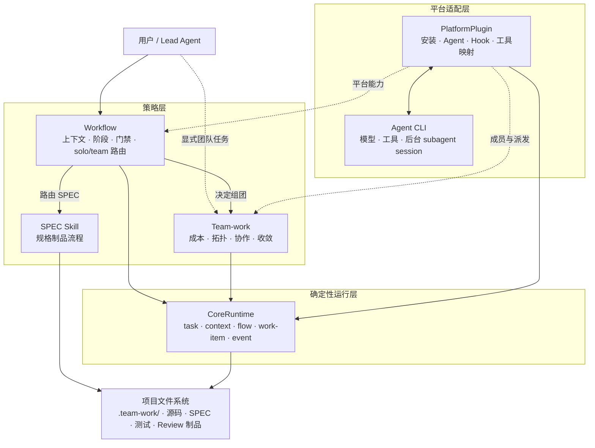
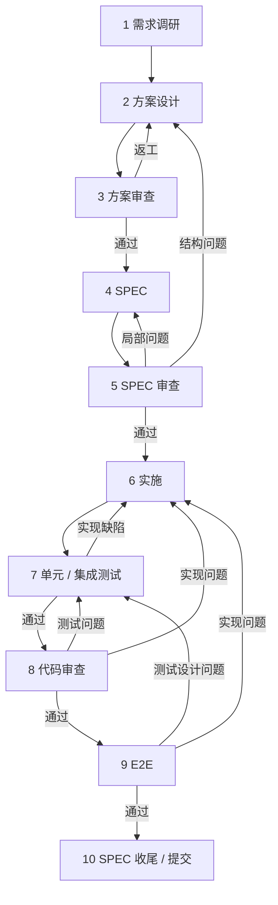
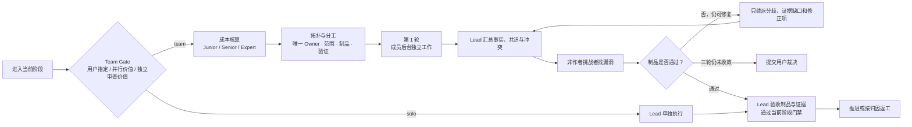

# team-work

## 简介

team-work 是一个平台无关的 multiagent engineering loop。它让 Lead Agent 管理研发阶段、任务上下文、制品和门禁，并在值得并行或需要独立审查时组建团队。

团队不是简单堆叠高价模型。team-work 使用 [Junior、Senior、Expert 三档成本体系](#成本控制与团队分档)：Junior 承担主要工作，Senior 负责复杂判断与挑战，Expert 用于高风险把关、关键攻坚或最终收口。



Workflow 和 Team-work 只依赖 CoreRuntime 的稳定接口。CoreRuntime 只依赖项目文件系统；PlatformPlugin 把不同 Agent CLI 的模型、工具和 multiagent 能力接入进来。首版支持 OpenCode。

## QuickStart

需要 Node.js 18+ 和 OpenCode 1.18.0+。安装是用户级操作，可在任意目录执行，不需要先进入项目：

```bash
npx team-work-runtime@latest install
```

安装器会创建唯一用户配置：

```text
~/.config/team-work/config.json
```

如果设置了 `XDG_CONFIG_HOME`，则使用 `$XDG_CONFIG_HOME/team-work/config.json`。OpenCode Skill、Agent、Plugin 和 Runtime 安装到其全局配置目录 `~/.config/opencode/`。

然后进入任意项目启动 OpenCode：

```bash
cd /path/to/your-project
opencode
```

输入：

```text
使用 workflow 处理这个需求。从实际阶段介入；根据并行价值和独立审查价值
决定 solo 或 team，组团时优先使用 Junior，所有成员后台派发。
```

首次调用 Workflow 或 Team-work 时，插件会在当前项目自动创建 `.team-work/` 工作目录。安装过程不会向项目根目录写配置。

## 使用说明

### 完整研发任务

从 Workflow 开始。它会创建或恢复任务、判断介入阶段、管理门禁，并在需要时调用 Team-work 或 SPEC Skill。

```text
使用 workflow 实现这个需求。复用已有设计和代码，从 implementation 阶段介入，
完成实现、测试、代码审查和收尾。
```

### 单独使用团队能力

直接调用 Team-work，适合方案讨论、设计审查、并行实施、测试或代码 Review。它会创建当前场景所需的轻量任务，不要求先补跑完整流程。

```text
使用 team-work 审查 src/imap/。从 code-review 阶段介入，覆盖全部审查视角，
安排非作者挑战者，最多三轮收敛并输出 Review 制品。
```

### 从已有制品介入

任务可以从任意阶段开始。只有代码时可直接进入 `code-review`；已有方案可进入 `design-review` 或 `spec`；已有实现需要补测试时可进入 `test`。门禁只检查当前阶段的最低输入。

### 查看或继续任务

```text
汇报当前任务的阶段、成员、work item、制品、阻塞和下一同步点，不要启动新成员。
```

跨会话继续时优先提供 task ID；不知道时让 Workflow 解析当前会话绑定或项目唯一活动任务。任务状态与制品索引保存在项目 `.team-work/` 中。

## 成本控制与团队分档

安装器提供三档通用 Agent。档位只描述模型能力上限与相对成本，不限制具体研发分工；分工由 Team-work 根据当前场景决定。

| 档位 | 默认成本权重 | 主要用途 | 使用原则 |
| --- | ---: | --- | --- |
| Junior | 1 | 事实探索、常规实现、测试、第一轮审查 | 默认主力；通常应参与正式团队 |
| Senior | 5 | 跨模块判断、高风险实现、独立方案、挑战者 | 多数正式场景配置一位 |
| Expert | 50 | 架构把关、关键攻坚、复杂重构、最终收口 | 大部分复杂场景保留一位；不机械增加第二位 |

权重用于相对预算判断，不代表供应商真实价格。默认成员池为：

- Junior：`junior-flash`、`junior-luna`
- Senior：`senior-terra`、`senior-glm`、`senior-qwen`
- Expert：`expert-opus`、`expert-k3`

同档引入多名成员时优先选择不同模型，减少单一模型偏差。正式团队必须由一位非当前制品作者的 Senior 或 Expert 兼任挑战者；Expert 既可把关，也可亲自承担复杂核心工作。

默认活跃成员软上限为 3–5 人，不含 Lead。第二位 Expert 只用于不可逆或高风险决策、关键证据冲突、重复验证失败、明显领域盲区，或用户明确要求的场景。

## 工作流

### 十阶段研发循环

Workflow 主导十阶段循环。下图是 Runtime 当前实现的合法状态边；返工按问题来源回到真正负责的阶段，而不是统一退回实施。



| 阶段 | 核心工作与典型制品 |
| --- | --- |
| 1. 需求调研 | 需求、项目架构、相关代码、外部事实、未知项和代码地图 |
| 2. 方案设计 | 方案初稿、权衡、风险、实施拆分和验证策略；团队讨论最多三轮 |
| 3. 方案审查 | 非作者独立审查事实、边界、成本、风险与需求符合度 |
| 4. SPEC | 将通过的方案转化为可实施、可验收的规范与任务 |
| 5. SPEC 审查 | 严格验证、交叉审查；局部问题回 SPEC，结构问题回方案 |
| 6. 实施 | 按互斥范围并行编码，保持既有架构与风格；Expert 可承担复杂核心工作 |
| 7. 测试 | 单元与集成测试，区分实现缺陷、测试缺陷和基础设施问题 |
| 8. 代码审查 | 覆盖需求、缺陷、安全、错误处理、逻辑、测试、类型、规范和影响范围 |
| 9. E2E | 开发夹具并验证真实用户路径，按归因回到实施或测试 |
| 10. 收尾 | 汇总 SPEC、实现、测试、Review 与 E2E 证据，准备提交和归档 |

### 每个阶段的 Team-work 协作环

Team-work 的独特部分发生在每个研发阶段内部，而不是额外增加一套研发状态机。



第一轮成员不得先互看结论，降低锚定；第二轮只处理分歧与证据缺口；第三轮由挑战者或必要 Expert 验证最终制品。最多三轮仍有重大分歧时停止自循环，由用户裁决。

所有 OpenCode 团队成员都使用后台 child session。成员自报完成、平台显示完成或消息送达都不等于通过；只有 Lead 核验证据并验收 work item 后，Workflow 才能推进阶段。

### OpenSpec 与工作流

[OpenSpec](https://github.com/Fission-AI/OpenSpec) 是首版默认 SPEC Skill，负责第 4、5 阶段的 SPEC 制品流程，以及第 10 阶段的 SPEC 收尾。它不是 team-work 的状态存储，也不负责多 Agent 调度。

未进入 SPEC 阶段时，缺少 OpenSpec 不影响调研、方案讨论、实现、测试或代码审查。需要 SPEC 流程时，在目标项目安装并初始化 OpenSpec；未来可通过同一 SPEC 路由接入 Spec Kit 等工具。

## 配置

唯一用户配置是 `~/.config/team-work/config.json`；设置 `XDG_CONFIG_HOME` 时路径随之变化。首次 `install` 会生成：

```json
{
  "schemaVersion": "1.0",
  "platforms": {
    "opencode": {
      "models": "auto"
    }
  },
  "spec": {
    "type": "openspec"
  }
}
```

自动解析有歧义，或需要指定模型与 reasoning effort 时，修改同一文件：

```json
{
  "schemaVersion": "1.0",
  "platforms": {
    "opencode": {
      "models": {
        "junior-flash": "aigw/deepseek-v4-flash",
        "junior-luna": "aigw/gpt-5.6-luna",
        "senior-terra": "aigw/gpt-5.6-terra",
        "expert-opus": "official/claude-opus-5"
      },
      "effort": {
        "junior-flash": "low",
        "junior-luna": "medium",
        "senior-terra": "high"
      }
    }
  },
  "spec": {
    "type": "openspec"
  }
}
```

`models` 必须使用 `opencode models` 返回的完整 `provider/model`。`effort` 按 Agent 配置，安装器会将其写为 OpenCode Agent 的 `reasoningEffort`。

可用 effort 值取决于模型、Provider 和网关，不支持时省略。参见 [OpenCode Agent 配置](https://opencode.ai/docs/agents/)。

自定义可执行文件时可设置 `platforms.opencode.command` 或 `spec.command`。项目 `.team-work/config.yaml` 是 Runtime 自动生成的内部配置，不是第二份用户配置。

修改配置后执行：

```bash
npx team-work-runtime@latest update
```

## 更新与卸载

```bash
npx team-work-runtime@latest doctor
npx team-work-runtime@latest update
npx team-work-runtime@latest uninstall
```

更新会保护并备份受管文件。卸载只移除用户级 OpenCode Skill、Agent、Plugin 和 Runtime；用户配置与各项目的 `.team-work/` 任务、制品、事件和归档全部保留。

## 常见问题

### Agent 不可用

运行 `npx team-work-runtime@latest doctor`。`AGENT_UNAVAILABLE` 通常表示模型名称错误、模型不可见、effort 不受 Provider 支持或 Agent 未安装。

按 `opencode models` 返回的完整名称修改 `~/.config/team-work/config.json`，必要时移除对应 `effort`，然后执行 `update`。
