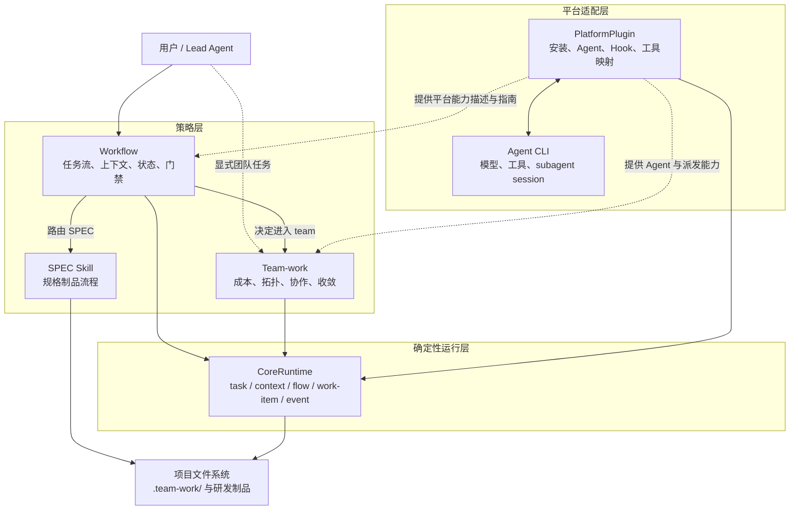
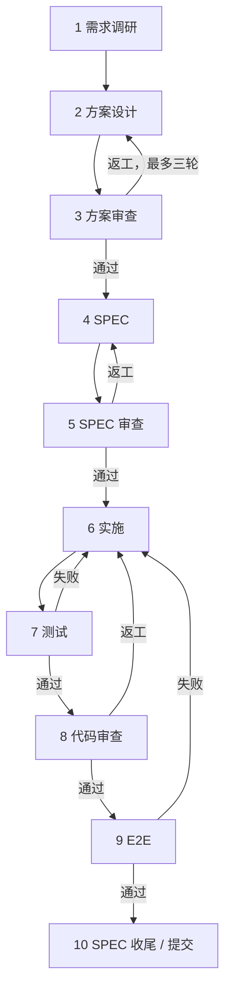

# team-work

## 简介

team-work 是一个平台无关的 multiagent engineering loop。它让主 Agent 按研发阶段管理上下文、制品和门禁，并在值得并行或需要独立审查时，按成本组建 Junior、Senior、Expert 团队。



Workflow 和 Team-work 只依赖 CoreRuntime 的稳定接口。CoreRuntime 只依赖项目文件系统；PlatformPlugin 负责把不同 Agent CLI 的模型、工具和 subagent 能力接入进来。

## QuickStart

需要 Node.js 18+ 和 OpenCode 1.18.0+。进入需要使用 team-work 的项目根目录后执行：

```bash
cd /path/to/your-project
npx team-work-runtime@latest install
opencode
```

安装器会在当前项目根目录创建：

```text
/path/to/your-project/team-work.config.json
```

配置位置与 macOS、Linux、Windows 无关，也不会写到用户主目录。使用 `--project /other/project` 时，配置会创建在指定项目根目录。

启动 OpenCode 后可以直接输入：

```text
使用 workflow 处理这个需求。从实际阶段介入，根据并行价值和独立审查价值
决定是否组团；优先使用 Junior 控制成本，所有团队成员后台派发。
```

## 工作流

Workflow 管理完整研发循环，但任务可以从任意阶段开始。已有代码可以直接从代码审查或测试阶段介入；门禁只检查当前阶段所需输入，不会因为缺少历史设计或 SPEC 制品形成死门。

| 阶段 | 主要工作与制品 |
| --- | --- |
| 1. 需求调研 | 理解需求、项目架构和相关代码；按需补充外部资料，形成调研上下文 |
| 2. 方案设计 | 评估复杂度和团队规模，提出方案并通过最多三轮讨论收敛 |
| 3. 方案审查 | 独立检查事实、边界、成本、风险和需求符合度，决定通过或返工 |
| 4. SPEC | 将通过的方案转化为可实施、可验收的规格与任务 |
| 5. SPEC 审查 | 交叉检查规格完整性、可测试性和方案一致性 |
| 6. 实施 | 按范围并行编码，保持现有架构和代码风格，必要时由 Expert 攻坚 |
| 7. 测试 | 完成单元和集成测试；发现问题返回实施阶段 |
| 8. 代码审查 | 覆盖正确性、安全性、性能、兼容性、可维护性和测试充分性 |
| 9. E2E | 开发夹具并验证真实业务路径；失败返回实施阶段 |
| 10. 收尾 | 核对 SPEC、制品和证据，归档任务并准备提交 |



每个阶段都可以根据并行收益和独立审查价值选择 solo 或 team。正式团队至少安排一名 Senior 或 Expert 作为非作者挑战者；多轮讨论和审查最多三轮，仍无法收敛时交给用户决策。

### OpenSpec 与工作流的关系

[OpenSpec](https://github.com/Fission-AI/OpenSpec) 是默认的 SPEC Skill，用来让用户与 AI 在编码前形成共同的规格、方案和任务清单。

它负责第 4、5 阶段的 SPEC 制品流程，以及第 10 阶段的 SPEC 收尾；它不是 team-work 的状态存储，也不负责多 Agent 调度。

未进入 SPEC 阶段时，缺少 OpenSpec 不影响调研、方案讨论、代码审查等任务。需要完整研发流程时，再安装并初始化。OpenSpec 最新版当前要求 Node.js 20.19+：

```bash
npm install -g @fission-ai/openspec@latest
openspec init
```

首版默认支持 OpenSpec；以后可以通过同一 SPEC 路由接入 Spec Kit 或其他规范工具。

## 使用方式

### 从 Workflow 开始

适合需要阶段管理、跨会话恢复、SPEC、实施、测试和审查的研发任务。

```text
使用 workflow 实现这个需求，复用现有设计和代码。从 implementation 阶段介入，
完成实现、测试、代码审查和收尾。
```

### 直接使用 Team-work

适合只需要团队讨论、并行实施、测试或代码审查的任务。Team-work 会创建轻量任务，不要求先运行完整 Workflow。

```text
使用 team-work 对 src/imap/ 做 code-review。从 code-review 阶段介入，
覆盖全部审查视角，安排非作者挑战者，最多三轮收敛并输出 Review 制品。
```

### 查看或继续任务

```text
汇报当前任务的阶段、成员、work item 状态、制品、阻塞和下一同步点，不要启动新成员。
```

跨会话继续时提供 task ID；不知道时让 Workflow 解析活动任务。任务状态和制品索引保存在项目 `.team-work/` 中。

## 配置

唯一的用户配置是项目根目录的 `team-work.config.json`。首次 install 会生成以下默认内容：

```json
{
  "schemaVersion": "1.0",
  "platforms": {
    "opencode": {
      "models": "auto"
    }
  },
  "spec": {
    "type": "openspec"
  }
}
```

模型自动解析存在歧义，或需要为 Agent 指定 reasoning effort 时，仍然只修改这个文件：

```json
{
  "schemaVersion": "1.0",
  "platforms": {
    "opencode": {
      "models": {
        "junior-flash": "aigw/deepseek-v4-flash",
        "junior-luna": "aigw/gpt-5.6-luna",
        "senior-terra": "aigw/gpt-5.6-terra"
      },
      "effort": {
        "junior-flash": "low",
        "junior-luna": "medium",
        "senior-terra": "high"
      }
    }
  },
  "spec": {
    "type": "openspec"
  }
}
```

`models` 的值必须与 `opencode models` 返回的完整 `provider/model` 一致。`effort` 按 Agent 配置；安装器会把它写成 OpenCode Agent 的 `reasoningEffort` 模型选项。

`reasoningEffort` 会由 OpenCode 透传给模型 Provider，实际可用值取决于模型、Provider 和网关；不支持时应省略对应 Agent。参见 [OpenCode Agent 配置](https://opencode.ai/docs/agents/)。

自定义可执行文件时可以设置 `platforms.opencode.command` 或 `spec.command`。`.team-work/config.yaml` 是 Runtime 生成的内部状态，不是第二份用户配置。

修改配置后执行：

```bash
npx team-work-runtime@latest update
```

## 更新与卸载

```bash
npx team-work-runtime@latest update
npx team-work-runtime@latest uninstall
```

更新会保护并备份受管文件。卸载只移除受管 Skill、Agent、Plugin 和 Runtime 文件，保留 `team-work.config.json`、任务、制品、事件和历史备份。

## 常见问题

### Agent 不可用

运行 `npx team-work-runtime@latest doctor`。`AGENT_UNAVAILABLE` 通常表示模型名称错误、模型不可见、effort 不受 Provider 支持或 Agent 未安装。

按 `opencode models` 的完整名称修改 `team-work.config.json`，必要时移除对应 `effort`，然后执行 update。
