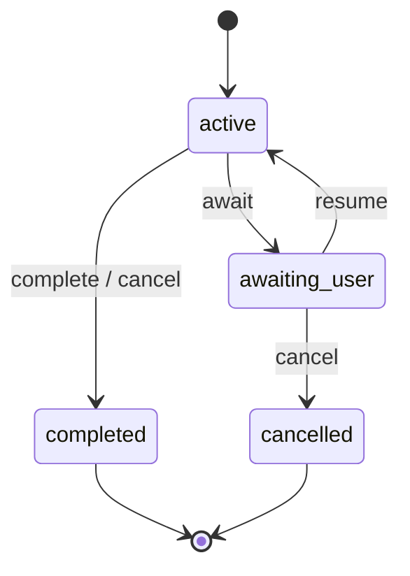
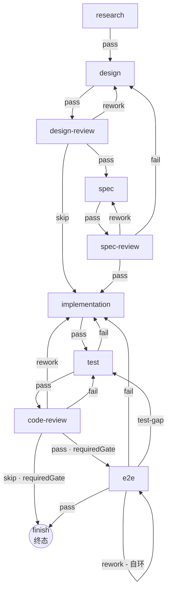
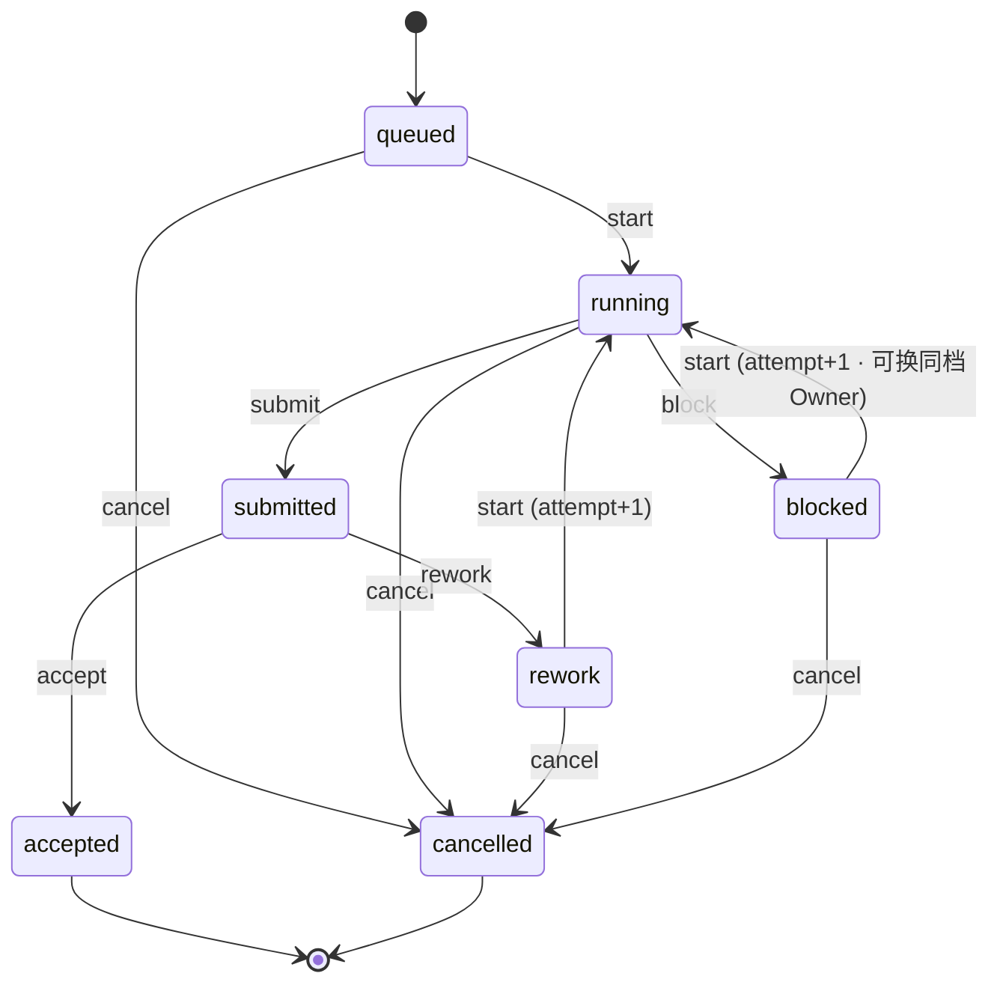
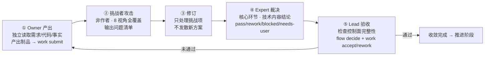

# team-work-runtime 架构解析：多智能体研发循环的设计精华

状态：开发者架构导读，提炼已落地实现的核心设计决策。不可变规则见 [`AGENTS.md`](../AGENTS.md)，设计基线见 [`runtime-plugin-design.md`](runtime-plugin-design.md)，逐项进度见 [`runtime-roadmap.md`](runtime-roadmap.md)。

## 这篇文章讲什么

`team-work-runtime` 是一个平台无关的多智能体研发循环（multiagent engineering loop）运行时。它让"Lead Agent 只管控制面、工作成员产出技术内容、非作者 Expert 裁决核心环节"这套协作范式，变成可落地、可恢复、可审计的确定性系统。

本文从已落地的源码出发，提炼五个层面的设计精华：三层分离、确定性状态机、拓扑选择与团队运作、三层协作信息流、设计哲学。读完后你将理解这个项目"为什么这样设计"以及"精华在哪里"。

---

## 一、三层分离——最核心的设计决策

整个系统被严格拆成三层。这不是出于美观，而是出于一个硬约束：**加一个新平台的代价必须被压到最低**。

```mermaid
flowchart TB
    subgraph POLICY["策略层 — Markdown Policy Skill"]
        W["Workflow Skill\nLead 怎么带流程"]
        T["Team-work Skill\n成员怎么分工协作"]
    end
    subgraph RUNTIME["确定性层"]
        C["CoreRuntime（runtime/core.mjs）\n文件 + 原子写入 + 文件锁\n不理解模型、成本、拓扑、平台"]
    end
    subgraph ADAPTER["适配层"]
        P["PlatformPlugin（plugins/opencode/）\n安装装配、Agent、Hook、异步派发\n换平台 = 只加一个 plugins/&#60;platform&#62;/"]
    end
    W -->|"调用稳定 CLI Interface"| C
    T -->|"调用稳定 CLI Interface"| C
    C --> P
```



### 四个 Module 的职责边界

| Module | 形态 | 负责 | 不负责 |
|---|---|---|---|
| **Workflow** | Markdown Skill | 上下文计划、十阶段研发循环、阶段门禁、solo/team 判断、SPEC 路由 | 文件事务、平台工具映射、团队内部拓扑 |
| **Team-work** | Markdown Skill | 成员选择、成本档位、分工、独立挑战、Expert 裁决、三轮收敛、恢复规则 | 选择 solo/team、持久化实现、解析平台配置 |
| **CoreRuntime** | 纯 JS 单文件（1183 行）| task/context/flow/work-item/event 的确定性操作、revision、锁、原子写入、审计 | 模型推理、成本/拓扑、SPEC 语义、平台调度 |
| **PlatformPlugin** | 平台适配器（首个：OpenCode）| 安装生命周期、Agent 定义、Hook、上下文注入、异步派发映射 | 研发流程语义、团队策略、控制状态归属 |

### 为什么分离

核心洞察：**策略需要人来阅读、理解、判断后执行；确定性操作交给机器**。

如果 Workflow 和 Team-work 是代码，它们就会和特定平台的 API 耦合。写成 Markdown 文档，它们就是平台无关的"协作宪法"——任何平台的 Lead Agent 读同一份文档、执行同样的策略，只是底层通过不同的 PlatformPlugin 落地。

三个关键约束保证了分离不被打破：

1. **策略层只调 CoreRuntime 的稳定 CLI**，从不直接改写 `.team-work/` 控制文件
2. **CoreRuntime 对平台一无所知**，没有 `.opencode` 字段、没有平台私有概念
3. **PlatformPlugin 是 composition root**——按平台打包前三者，本身不增加业务规则

这让"加一个新平台"变成只写 `plugins/<new-platform>/`，不碰 Workflow、Team-work、CoreRuntime 的任何一行。

---

## 二、五个状态机——确定性流转

CoreRuntime 内部有五个独立但协作的状态机。每一层只管自己的状态合法性，上层流转不假设下层状态，但会在关键节点做交叉校验。

- **Task**（任务生命周期：active → completed/cancelled）
  - **Stage**（研发阶段：十阶段有向图）
    - **Gate**（阶段门禁：pending → passed / blocked / overridden）
    - **Evidence**（证据：valid → invalidated）
    - **Work Item**（工作项：queued → accepted / cancelled）
      - **Attempt History**（每次返工/阻塞的历史快照）

### 2.1 Task 状态机——最外层生命周期



`complete` 是最严格的一个动作——必须同时满足：task 是 active、当前阶段门禁全过、work items 全部 accepted/cancelled、accepted work item 的 evidence 全部 valid、有 acceptance evidence。完成后 `persistTask` 还会做一遍全量语义再校验作为双保险。

### 2.2 Stage 状态机——十阶段有向图

这不是简单的线性链，而是带返工分支、跳过路径和自环的 DAG：



推进一个阶段（`advanceFlow`）要过**五道关卡**：

| 关卡 | 校验内容 | 失败错误码 |
|---|---|---|
| ① 状态 | task.status === "active" | `ILLEGAL_TRANSITION` |
| ② 合法边 | workflow.transitions 里有 (from, outcome) 的边 | `ILLEGAL_TRANSITION` |
| ③ 门禁 | evaluateCurrentStage().gate.ok（requiredInputs + gate 状态 + work items + evidence） | `GATE_BLOCKED` |
| ④ SPEC 路由 | enforceSpecRoute() 检查 auto/required/disabled 三态 | `GATE_BLOCKED` |
| ⑤ requiredGate | transition 声明的门控（如 `e2e-applicability`）必须有 passed/overridden 记录 | `GATE_BLOCKED` |

推进后有两件事自动发生：**teamDecision 重置为 undecided**（每进新阶段重新判断 solo/team）、revision+1、写审计事件。

### 2.3 Work Item 状态机——工作项的生命周期



**attempt history** 是审计追溯的关键设计：每次从 rework 或 blocked 重新 start 时，旧 attempt 的完整快照（submission/acceptance 或 owner/blockage）被存入 `attemptHistory`。语义校验要求历史必须是无重复、严格递增的 `1..attempt-1` 完整集合，每条必须以 rework 或 infrastructure blockage 结尾。这保证了每一个工作项的每一轮经历都可完整复盘。

两种失败有严格区分：

| 失败类型 | 触发 | 恢复策略 |
|---|---|---|
| **任务失败**（事实错误/缺陷/测试不过）| `submit → rework` | 直接返工，引用被拒证据；反复返工提示设计问题 |
| **基础设施失败**（网关/限流/失联）| `running → block` | 同成员重试 2 次（退避）→ 同档换模型 1 次 → 不得静默升级档位 |

### 2.4 Gate——阶段门禁的守卫

三种 kind（deterministic / semantic / human）× 四种 status，条件语义设计得很精巧：

| status | 必须有 | 必须没有 |
|---|---|---|
| `pending` | — | evidenceRefs、blocker、decision |
| `passed` | decision + ≥1 evidenceRefs | — |
| `blocked` | blocker | — |
| `overridden` | blocker + decision + ≥1 evidenceRefs | — |

`overridden` 处理"死门"场景：某个 gate 永远过不了但任务必须继续。你必须同时留下 blocker 和 decision，**不能静默跳过**。

### 2.5 回滚——唯一可以后退的机制

回滚（`flow rollback`）有三个硬约束：task 必须是 active、目标 stage 必须更早、必须有 reason + evidence。

回滚的连锁反应体现了"审计链永不断裂"的哲学：

- **gate 重置为 pending**（不是删除）
- **evidence 标记为 invalidated**（不是删除，保留 invalidationReason）
- **teamDecision 重置为 undecided**

数据永远不丢，只改状态。这让任何时刻都可以完整重建任务的历史轨迹。

### 2.6 状态变更的安全壳

所有 Task/Stage 级别的状态变更最终都经过 `persistTask`，它是最后一道防线：

```
persistTask(currentTask, nextTask, eventType)
  │
  1  AJV schema 校验 nextTask
  2  validateTaskAgainstWorkflow() — 全量语义再校验
  3  dryRun? ── 是 ──→ 只返回不写
     │
     否
     │
  4  withLock(taskRoot/.lock)
     │
  5    重新 loadTask（拿最新状态）
  6    assertRevision() — 乐观锁二次校验
  7    准备审计事件
  8    withLock(.events.lock)
       └─ commitTaskFiles: task.json + events.jsonl 原子写入
```

双锁 + 乐观锁重检意味着：即使两个进程同时推进同一个 task，只有一个会成功，另一个拿到 `REVISION_CONFLICT`，必须重读后重做决策（不盲目重试）。

---

## 三、拓扑选择与团队运作

### 3.1 solo/team 判断——决策权在 Workflow

一个常被忽略但至关重要的边界：**Team-work Skill 不做拓扑决策**。它在上层已经决定 solo/team 之后才启动。

判断流程（`team-and-spec-routing.md`）：

```
用户明确要求 team？ → 是 → 直接 team
                 → 否 → 依次评估：
   ① 是否有 ≥2 项可并行、边界清楚的工作？
   ② 单一 Owner 是否会因范围/领域/上下文容量形成瓶颈？
   ③ 多 Owner 同步成本是否 < 并行收益？
   ④ 是否有可用 Platform Profile + 合适档位 Agent + 并发容量？
```

最精巧的约束是：**"独立挑战"和"Expert 裁决"不是选 team 的理由**——因为 solo 同样必须做这两件事。如果"需要审查"就组 team，那 team 就变成"审查"的同义词，而不是"并行"的同义词。并行才是 team 存在的唯一理由。

决策通过 `task team` 命令持久化，进入新阶段时自动重置为 undecided。一个硬性安全规则：**由 Workflow 自主判断出的 team 不能静默降级为 solo**——如果发现平台能力缺失，必须 `task await` 请用户决定。

### 3.2 成本档位与推荐拓扑

| 档位 | costWeight | 典型角色 |
|---|---|---|
| Junior | 1 | 默认 Owner 主力：事实探索、常规实现、测试、第一轮审查 |
| Senior | 10 | 跨模块判断、高风险实现、独立方案、挑战者首选 |
| Expert | 50 | 架构把关、关键攻坚、最终收口、核心环节技术裁决 |

设计原则是"最低充分团队"——不组多余的成员，活跃成员软上限 3-5 人（不含 Lead）。推荐拓扑按场景而非按任务固定：

| 场景 | 最低充分拓扑 |
|---|---|
| 需求/代码调研 | 1 Junior Owner + 1 Senior 挑战者 |
| 方案讨论 | 1 Junior 事实位 + 1 Senior 方案位 + 1 Expert 裁决 |
| 并行实现（team）| 多个互斥 Owner + 非作者 Senior 挑战者 + 核心 Expert |
| 代码 Review | 覆盖全部视角的 Owner + Senior 挑战者 + 1 Expert 终裁 |

成员选择脚本 `select-members.mjs` 用确定性 seed 做 xorshift PRNG，采用**模型多样性优先**策略：round-robin 跨 model 组抽取，避免两个同模型成员给出同质化产出。候选不足则拒绝，不凑合。

### 3.3 三轮收敛循环

每一轮都是"产出 → 攻击 → 修订 → 裁决 → 验收"的完整闭环：



| 轮次 | 焦点 |
|---|---|
| 第一轮 | 独立调查/产出，查基础事实、需求偏移、明显漏洞 |
| 第二轮 | 只处理冲突、遗漏和证据缺口，验证修正是否真关闭问题 |
| 第三轮 | 验证最终制品、残余风险；Expert 给最终裁决 |

最多 3 轮是自主循环上限。仍有重大分歧时直接请求用户（列出事实/选项/影响/Expert 推荐），用户可授权有目标+预算的有限追加轮次。

### 3.4 Team-work 如何依赖 Runtime

Team-work Skill 是纯 Markdown，本身无状态——所有状态操作通过 CoreRuntime CLI 完成：

| Team-work 要做什么 | Runtime 命令 |
|---|---|
| 接入任务 | `task show` / `task create` / `task team` |
| 为成员建工作项 | `work create` |
| 启动成员工作 | `work start` |
| 成员提交产出 | `work submit` |
| 记录基础设施失败 | `work block` |
| 换同档模型重派 | `work start --owner <new-agent>` |
| Lead 记录验收证据和门禁 | `flow decide --status passed/blocked` |
| Lead 接受/返工工作项 | `work accept` / `work rework` |
| 请求用户决定 | `task await` |
| 查看门禁状态 | `flow check` / `flow status` |

每条写命令都携带 `--expected-revision`，冲突时拿到 `REVISION_CONFLICT` 重新读取重做决策。Agent 工作可以并行，但 Runtime 写入由 Lead 串行提交——这不是瓶颈，因为 Runtime 操作是纯文件 I/O，毫秒级完成。

---

## 四、三层协作的完整信息流

以 team 模式并行实现"登录+注册"两个功能为例，追踪从用户一句话到 work accept 的完整链路：

```
用户："帮我实现登录和注册"
  │
  ▼  Workflow Skill
     · 创建任务 T001（entry=implementation）
     · 判断拓扑：2 个独立功能 → team
     · task team --mode team → CoreRuntime: task.team-decided
  │
  ▼  Team-work Skill
     · 选拓扑：2 Owner + 1 Senior 挑战者 + 1 Expert 裁决
     · select-members.mjs 选成员
         Owner-A: junior-flash（登录）  Owner-B: junior-luna（注册）
         挑战者: senior-terra           Expert: expert-opus
     · 为每人 work create ×4，启动 Owner work start ×2
  │
  ▼  PlatformPlugin（OpenCode）
     · validateAssignment → session.create（parentID = Lead）
     · contextForSession（只注入路径索引，不注入制品正文）
     · session.promptAsync ← 非阻塞! child session 后台工作
     · Lead 不被阻塞，持续掌握 Harness
  │
  ▼  Owner-A 和 Owner-B 并行工作 → 各自 submit
  │
  ▼  Team-work 收敛
     第一轮  挑战者发现 login 缺错误边界
             → flow decide(blocked) + work rework
     第二轮  挑战者确认关闭 → flow decide(passed)
     Expert  expert-opus 裁决: pass
     验收    Lead: work accept ×2
  │
  ▼  Workflow 继续控制
     · evaluateCurrentStage: requiredInputs ✓ gate ✓ work items ✓ evidence ✓
     · advanceFlow: pass → test
     · teamDecision 重置为 undecided（下阶段重判）
```

### 基础设施失败的恢复链路

```
Owner child session 遇到网关错误
  │
  1  PlatformPlugin 检测到
     · 不改变 Runtime 状态
     · 写审计事件 platform.dispatch.failed，映射保留 dispatchError
  │
  2  Lead 用 work block 记录 → workItem.status = "blocked"
  │
  3  同一成员重试 2 次（退避）→ work start（attempt+1）
     │
     ├─ 恢复 → 继续工作
     │
     └─ 仍失败 ↓
  │
  4  同档换模型 1 次
     · work start --owner junior-luna（同档，新 Owner）
     · 不得静默升级到 Senior / Expert
     │
     ├─ 恢复 → 继续工作
     │
     └─ 同档仍失败 ↓
  │
  5  降级或 task await 请求用户
     · 保留已有制品和错误记录
     · 不伪造 submission
```

---

## 五、设计哲学提炼

### 1. Lead 永远不碰具体工作

Lead 只管 Harness（上下文、阶段、门禁、派发、制品、证据）。技术内容由工作成员产出 + 非作者 Expert 在核心环节裁决。这是整个系统的灵魂——避免了"Lead 既当裁判又当运动员"的常见 AI Agent 陷阱。

### 2. "完成" ≠ "通过"

Agent 自报完成 ≠ 验收通过。平台显示完成 ≠ 验收。消息送达 ≠ 验收。只有 Lead 核对控制面完整性 + `work accept` 才算通过。`accept` 和 `rework` 都**必须引用 valid evidence**——被拒也要有证据。

### 3. fail-closed 原则

损坏状态、未知映射、校验失败一律拒绝推进，绝不"自动修复"成错误结果。平台基础设施失败则 retryable 但不污染验收状态。宁可阻塞请求用户，不带着错误继续。

### 4. Skill 不充当数据库

Team-work Skill 是纯 Markdown 文档，本身无状态。所有状态通过 CoreRuntime CLI 持久化。这让策略可以被人阅读理解，也让状态管理有唯一事实源。

### 5. 审计链永不断裂

回滚不删数据只 invalidate，evidence 变 `invalidated` 而非删除，gate 重置为 `pending` 而非移除。events.jsonl 是 append-only 事实源。任何时刻都可以完整重建任务的历史轨迹。

### 6. background 派发保证不阻塞

从 schema（profile `blockingPolicy: "reject"`）→ adapter（只用 `promptAsync`）→ plugin asset（hook 拦截原生 task 工具）三层强制非阻塞派发。Lead 永远不被成员阻塞，持续掌握 Harness 并在显式同步点收集结果。

---

## 技术栈速览

| 维度 | 选择 |
|---|---|
| 语言 | 纯 JavaScript ESM（`.mjs`），无 TypeScript，无编译 |
| 依赖 | 仅 `ajv` + `ajv-formats`（JSON Schema 校验）|
| 存储 | 纯文件系统（文本 + JSONL + 原子写入 + 文件锁），无数据库 |
| 测试 | Node 原生 `node --test`，11 个文件，127 个 case |
| 首版平台 | OpenCode 1.18.0+ |
| SPEC 集成 | OpenSpec 作为默认可选 SPEC Skill |

## 当前进展

| 能力 | 状态 |
|---|---|
| Runtime 1.0 契约 + 文件型 CoreRuntime | 完成 |
| Workflow / Team-work Policy Skill | 完成 |
| OpenCode PlatformPlugin（安装/异步派发/Hook）| 落地 |
| 低成本多模型 E2E（网关故障恢复链路）| 验证完成 |
| 正式 Workflow 场景 E2E（含 Senior 挑战者）| 进行中 |
| Claude Code / OMO 平台 / 稳定性打磨 | 待开始（Phase 5-6）|

## 参考文档

- [`AGENTS.md`](../AGENTS.md) — 不可变的产品边界与 15 条核心规则
- [`runtime-plugin-design.md`](runtime-plugin-design.md) — 四 Module 设计基线与核心架构图
- [`runtime-interface.md`](runtime-interface.md) — CoreRuntime Interface 1.0 契约
- [`runtime-roadmap.md`](runtime-roadmap.md) — 六个 Phase 的路线图与完成标准
- [`runtime-implementation-plan.md`](runtime-implementation-plan.md) — 逐项实施与验收地图
