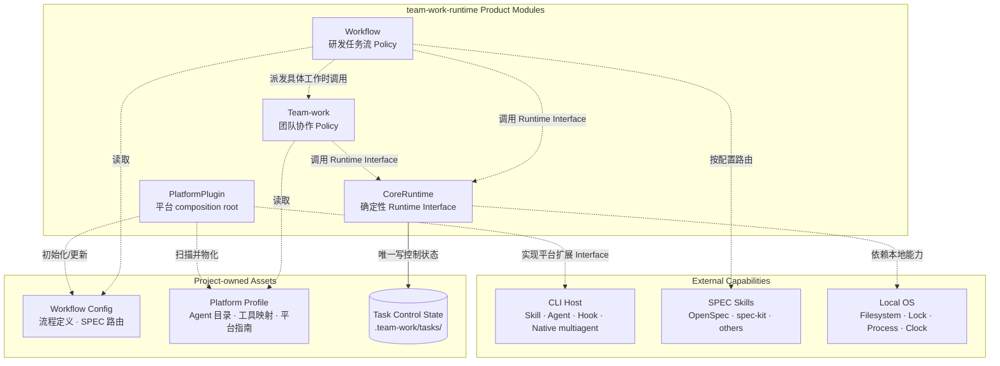
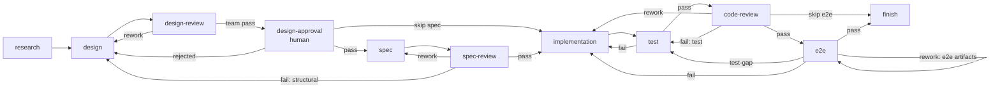
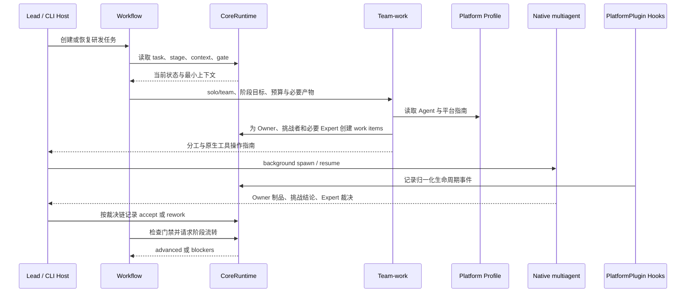

# team-work-runtime Multiagent Engineering Loop 设计

状态：设计基线，指导 Runtime、Workflow、Team-work 与首个平台 Plugin 的实现。产品约束见 [`AGENTS.md`](../AGENTS.md)，阶段计划见 [`runtime-roadmap.md`](runtime-roadmap.md)。

## 1. 产品定位

`team-work` 要实现一个面向研发场景、可跨会话恢复的 multiagent engineering loop。产品只有四个核心 Module：

1. **Workflow**：主导研发任务流；
2. **Team-work**：主导团队协作策略；
3. **CoreRuntime**：执行确定性的上下文、状态和门禁操作；
4. **PlatformPlugin**：完成安装装配和 CLI 平台适配。

Multiagent engineering loop 是四者组合形成的产品能力，不再抽象第五个 Engine。初版不实现 N-to-N 消息总线、分布式调度、常驻 daemon、统一多 CLI UI，也不让 Hook、Runtime 或 Lead 代替工作成员与 Expert 作技术内容判断。

## 2. 四个 Module

| Module | 负责 | 不负责 |
| --- | --- | --- |
| Workflow | 上下文计划、研发阶段、任务状态、流程门禁、solo/team 判断、SPEC Skill 路由、人工介入 | 文件事务、平台工具映射、团队内部拓扑 |
| Team-work | 在既定 solo/team 模式下执行成员工作、成本与预算、Junior/Senior/Expert 拓扑、成员选择、场景协作、三轮收敛、团队汇报、通用恢复规则 | 选择 solo/team、持久化实现、直接解析平台配置 |
| CoreRuntime | task/context/flow/work-item 的确定性操作、revision、锁、原子写入、事件、诊断和恢复 | 模型推理、成本/拓扑、SPEC 语义、平台 Agent 调度 |
| PlatformPlugin | 安装与更新、Agent 定义、Hook、上下文注入、原生 multiagent 映射、平台指南、配置扫描、SPEC 工具准备 | 研发流程语义、团队策略、项目控制状态 |

Workflow 与 Team-work 是平台无关 Policy Skill。CoreRuntime 是一个深 Module，只暴露稳定 CLI + JSON Interface。PlatformPlugin 是 composition root：按平台打包前三者及平台资产，本身不增加业务规则。

## 3. 核心架构

下图只表示静态依赖和数据所有权，不表示执行顺序。虚线箭头表示“依赖/读取/实现”，实线表示状态所有权。



关键依赖规则：

- Workflow 运行时不依赖 PlatformPlugin Implementation，只读取项目 Workflow Config；
- Team-work 不读取 `.claude`、`.opencode` 等原始配置，只读取 PlatformPlugin 生成的 Platform Profile；
- Workflow 条件依赖 Team-work，Team-work 不反向依赖 Workflow；
- Workflow 与 Team-work 都通过 Lead 调用 CoreRuntime Interface；
- CoreRuntime 不依赖 Workflow、Team-work、PlatformPlugin、CLI Host、LLM、MCP 或网络；
- PlatformPlugin 安装期装配前三个 Module，运行期只处理平台扩展和事件适配。

## 4. 项目资产与配置

```text
.team-work/
├── config.yaml
├── workflows/
│   └── engineering.yaml
├── bindings/<platform>/<session-key>.json
├── platform/
│   └── <platform>/
│       ├── profile.json
│       └── guides/
│           ├── team-work.md
│           └── recovery.md
├── tasks/<task-id>/
│   ├── task.json
│   ├── context.jsonl
│   ├── index.md
│   ├── work-items.json
│   ├── events.jsonl
│   ├── .txn/
│   └── artifacts/
└── archive/
```

| 资产 | 所有者与写入者 | 用途 |
| --- | --- | --- |
| `config.yaml`、`workflows/**` | 项目配置；PlatformPlugin 首次调用时通过 CoreRuntime 初始化，用户可显式修改，CoreRuntime 校验 | Workflow、Runtime 和 SPEC 路由 |
| `bindings/<platform>/**` | 仅 CoreRuntime 写入；可重建 | 当前平台会话到稳定 task-id 的绑定 |
| `platform/<platform>/profile.json` | PlatformPlugin 扫描并物化 | Team-work 获取 Agent、能力、限制和指南路径 |
| task 控制文件、context、work-items、events、`.txn/` | 仅 CoreRuntime 写入 | 跨会话恢复、状态、门禁和审计 |
| `tasks/<task-id>/artifacts/**` | assignment 指定的 Lead/成员写入，CoreRuntime 注册和校验 | 调研、方案、审查、汇总、评分等任务制品 |
| 源码、项目 SPEC、设计和测试 | 原有项目工具和目录 | 工程事实源，不复制进控制状态 |

SPEC 路由属于项目 Workflow Config，而不是某个平台：

```yaml
spec:
  type: openspec
  skill: openspec
  root: openspec/
  mode: auto
  status: ready
humanReview:
  design-approval: required
  final-acceptance: required
```

默认工程 Workflow 在方案审查后和任务完成前声明两个人工门禁。项目可把它们配置为 `required|optional|disabled`；人工批准绑定当前方案或最终报告的文件指纹，批准制品变化后由 CoreRuntime 阻止继续推进。

PlatformPlugin 首次接入项目时可以初始化默认路由并同步工具就绪状态，但 Workflow 只依赖配置结果。切换 Claude Code、OpenCode 或其他 CLI 时，项目的 SPEC 选择保持不变。

## 5. Workflow

Workflow 是研发循环主控，负责“应该做什么”，CoreRuntime 负责“可靠地执行状态操作”，PlatformPlugin 负责“如何接入当前 CLI”。

### 5.1 上下文管理

Workflow 决定：

- 当前阶段需要哪些源码、SPEC、设计、测试和团队制品；
- 哪些内容注册为长期任务资产；
- Lead、research、implement、check 分别读取什么；
- 何时刷新摘要或要求直接读取原文。

CoreRuntime 提供创建、注册、digest、索引和 profile 渲染；PlatformPlugin 在 SessionStart、resume、subagent/team 派发等平台时机执行注入。三者不能互相替代。

### 5.2 流程与任务状态

Workflow 以“任意阶段可介入”为设计原则：创建任务时可以指定当前研发阶段并注册已有制品，无需补跑之前的阶段。阶段门禁只校验当前阶段声明的最低必需输入；历史需求、设计、SPEC、测试等制品仅在被当前阶段明确声明为必需时才阻塞，否则作为可选上下文或缺失风险记录。例如 `code-review` 只要求代码和明确的审查范围，即使没有设计或 SPEC 文档也可以直接开始。

默认研发流程：



`design-review` 的 `pass/skip` 边声明 `requiredGate: design-approval`；`code-review` 的 `pass/skip` 边声明 `requiredGate: e2e-applicability`；terminal `finish` 完成前检查 `final-acceptance`。因此方案批准、E2E 适用性和最终验收都不能仅靠 Skill 提示词约束。

Workflow 解释阶段目标和语义；CoreRuntime 校验合法状态边并记录：

1. **确定性门禁**：文件、work item、验证命令和证据路径；
2. **语义门禁**：方案、设计和审查质量，由非作者 Expert 作内容结论，Lead 只记录并核对裁决链；
3. **人工门禁**：默认强制的方案批准与最终验收，以及需求缺失、重大分歧和高风险操作。

CoreRuntime 只验证后两类门禁是否具有合法决策、理由和证据，不生成结论。门禁失败返回 blocker 和可执行修复建议；override 必须保留原 blocker 与原因。

### 5.3 Team 与 SPEC 路由

- 用户明确要求 team 时，Workflow 选择 `team`；否则根据场景和并行价值判断 `solo/team`；
- 两种模式都调用 Team-work：`solo` 派发一个成员 Owner，`team` 派发多个边界互斥的 Owner；Lead 均不承担具体工作；
- 在 SPEC 路由点读取 `spec.type/skill/root/mode/status`；`auto` 可跳过，`required` 缺失时阻塞，`disabled` 始终跳过；
- SPEC Skill 负责具体规范流程，Workflow 只负责阶段衔接、上下文和门禁。

CoreRuntime 根据 Workflow 的 `specRoute` 标记和项目 SPEC 状态校验进入/跳过边，避免直接调用 Runtime 命令绕过 `required` 或跳过已 ready 的默认路由。

## 6. Team-work

Team-work 保留当前已积累的核心能力：

- Junior/Senior/Expert 三档成本与预算建议；
- 方案讨论、设计审查、代码 Review、并行实施、测试/E2E 等拓扑；
- 唯一 Owner、范围、完成条件、产物路径和验证要求；
- Owner 独立产出、非作者逐轮挑战、Owner/整合者修订、Expert 内容裁决和最多三轮自主收敛；
- Lead 只核对流程、制品、证据与复核链，负责记录、返工派发、团队汇报和可选同档评分，不重写技术结论；
- `solo` 与 `team` 的每个相对完整工作单元都由 Senior/Expert 挑战非本人制品；设计、SPEC、代码 Review、E2E 结果和高风险实现/测试还需非作者 Expert 裁决；
- 三轮未收敛时直接向用户给出简明阶段摘要；只有用户显式授权目标、轮数和预算后才增加有限轮次；
- 通用的成员失联、结果缺失和交付恢复规则。

Team-work 通过 CoreRuntime 的通用 work item 记录 assignment，不要求 CoreRuntime 理解成本档位、团队拓扑或平台 Agent。一个 work item 对应一个成员会话：同一轮次链复用该会话；换 Owner、失联、职责实质改变或需要独立第二意见时才新建。Expert 裁决位在同一阶段保持同一 work item/session，跨阶段重新建立。候选随机选择仍属于 Team-work 的策略/工具，不进入 CoreRuntime。

Platform Profile 为 Team-work 补充：

- 当前可用 Agent、模型和成本档位；
- 原生 `spawn/assign/message-or-resume/status/stop` 的工具映射；
- 并发硬限制、session/UI 能力和已知降级；
- 仅当前平台需要的恢复、通信或兼容规则。

平台指南必须采用增量规则：通用恢复保留在 Team-work，只有观察到平台事实问题后才增加特殊协议。Team-work 直接使用且没有活动任务时，根据场景通过 CoreRuntime 从 `design`、`code-review`、`implementation`、`test` 等实际研发阶段创建轻量任务，只满足当前阶段最低输入，不强制补跑完整 Workflow。

## 7. CoreRuntime

CoreRuntime 初版只提供一个 CLI + JSON Interface：

```text
team-work init|doctor|version|migrate
team-work task create|bind|show|team|spec|await|resume|complete|cancel|archive
team-work context register|list|render|rebuild
team-work flow status|check|advance|rollback|decide
team-work work create|start|submit|accept|rework|block|cancel
team-work event list|record
```

通用参数包括 `--project`、`--task`、`--session`、`--expected-revision`、`--json` 和 `--dry-run`。成功结果使用稳定 `ok/apiVersion/taskId/revision/data/warnings`；失败结果使用稳定 `code/message/retryable/blockers/remediation`。调用方不得解析人类文本判断结果。

CoreRuntime 内部负责：

- 项目根和活动任务解析；
- context manifest、digest、profile render 和可重建索引；
- workflow pin、状态边和 gate 计算；
- 通用 work item 的 Owner、attempt、submit/accept/rework；
- task lock、revision、同目录临时文件、原子替换和事务恢复；
- 事件、doctor、schema migration 和 archive。

底层只依赖项目文件系统、文件锁、原子 rename、时钟、ID、摘要和受限本地进程执行。文件系统是本地 Implementation 依赖，不暴露公共 storage port；测试直接使用真实临时目录。

## 8. PlatformPlugin

PlatformPlugin 包含安装期与运行期两类职责。

### 8.1 安装与更新

1. 在用户级平台目录安装或更新 CoreRuntime、Workflow、Team-work；
2. 安装 Hook、Harness 指南和启动时 Agent 配置适配器；
3. 扫描原生 multiagent、模型、工具、权限、并发和 UI 能力；
4. 生成用户级 Platform Profile、增量 guides 与平台设置；
5. 执行版本、路径、Hook 和最小 team smoke test；
6. 首次项目调用时懒初始化 `.team-work/`，物化当前 Profile/指南并只读检查默认 OpenSpec；
7. 缺少 SPEC 工具时按 `auto|required|disabled` 处理，不影响无关阶段。

安装器不得静默覆盖已有 Workflow/SPEC 选择；修改前备份，重复执行必须幂等。模型网关、凭据、MCP 和用户权限仍由 CLI Host 管理，Plugin 只检查并报告。

### 8.2 运行期适配

- 在平台生命周期事件中解析 session 与活动任务；
- 调用 CoreRuntime `context render` 并注入相应 profile；
- 将原生 member/task/session/model/failure 归一化后记录为 Runtime event 或 work-item metadata；
- 提供原生 multiagent 工具映射和平台增量恢复指南；
- 通过平台原生 UI 扩展点提供受管成员状态与 session 导航，但只读取 Runtime 映射，不另建团队状态源；
- 允许普通非受管 Agent 调用无影响地通过。

PlatformPlugin 不直接决定团队拓扑，也不在后台启动第二套调度器。Lead 按 Team-work 与 Platform Profile 使用 CLI Host 原生 multiagent 工具。

### 8.3 平台实现

| 平台 | Plugin 重点 |
| --- | --- |
| OpenCode（首版） | 原生 skill/agent/plugin、subagent child session、session 生命周期、工具事件和 UI 导航 |
| Claude Code | Plugin skills/agents/hooks、Agent Teams、Agent/SendMessage/task、SessionStart 与团队事件、tmux/iTerm2 配置 |
| OMO on OpenCode | 复用 OpenCode Plugin，增量映射 `team_*`、category、member/task 与 tmux；不复制 CoreRuntime |

OpenCode 首版目录：

```text
plugins/opencode/
├── assets/
│   ├── team-work.js            # OpenCode Server Plugin 入口
│   └── team-work-tui.tsx       # OpenCode TUI Plugin 入口
├── config/
│   ├── agents.json             # 七个通用成本档位定义
│   └── runtime-package-lock.json # 全局 Runtime 依赖锁
├── guides/                     # 安装为 Platform 增量指南
├── scripts/manage.mjs          # 统一 npm CLI 的源码入口包装
├── src/                        # Server 子模块
│   ├── lifecycle.mjs           # digest 清单、备份、回滚、smoke test
│   ├── agent-config.mjs        # 启动时动态注入 Agent model/effort
│   └── opencode-adapter.mjs    # promptAsync、session 映射、上下文注入
└── tui/                        # TUI 子模块
    ├── team-work-tui.tsx       # TUI target 与 sidebar slot 注册
    ├── team-sidebar.tsx        # 成员状态、Lead 返回和 session 跳转
    ├── team-sessions.mjs       # 只读 task/session 映射视图
    └── team-tui-plugin.mjs     # 可测试的平台注册边界
```

平台无关 Skill 只有根目录 `skills/` 一份源码，安装器物化 Skill、Runtime、schema 和 Plugin。Plugin 启动时读取用户配置并动态注入 Agent；修改 model/effort 后重启 OpenCode 即可。项目任务留在 `.team-work/`，协作基线是“Lead + 多 subagent + 共享制品/Lead 转发”。

生命周期管理只拥有全局安装清单列出的文件：更新先快照旧受管文件，碰撞或本地修改默认失败，smoke test 失败回滚；卸载不扫描项目，因此所有 `.team-work/` 任务、制品、Workflow/SPEC 配置和平台 session 历史都被保留。最低 OpenCode 版本用于排除已知不兼容接口，不设置最高版本上限。

OpenCode Adapter 对受管 `solo/team` 派发只暴露 background/non-blocking Interface，不允许 Team-work 选择阻塞式 subagent 调用。Lead 在成员运行期间继续维护 Harness 或派发其他独立工作，并只在场景定义的同步点查询状态和收集结果，禁止转而承担成员的具体工作。底层工具若收到受管任务的阻塞式请求，Adapter 必须拒绝或确定性改写为 background；普通非 Team-work 调用不受此规则影响。

Adapter 按 work item 的派发轮次持久记录 `idle/error/lost` 待同步提示；`idle` 事件必须复核原生实时状态，避免上一轮延迟事件错配到新的 busy 派发。事件只唤醒当前进程内的有界等待，提示本身保存在既有 session mapping 中，因而可跨会话恢复。Lead 等待默认 10 秒、最长 30 秒，事件遗漏时低频复核原生 session 状态；返回只表示应收集消息，不替代制品验收、Workflow 流转或用户输入队列。首版不实现自动续写 Lead、独立 Inbox、永久定时任务或第二套 Agent 调度器。

首版使用 Plugin `tool.execute.before` 在已绑定或唯一可解析的活动 `solo/team` 任务中拒绝原生阻塞 `task`，并要求受管派发通过 `team_work_spawn`。spawn 在创建 child session 前必须验证 Platform Profile 中的已解析 Agent、活动任务拓扑、Runtime work item、唯一 Owner 和可派发状态；同一 work item 的后续轮次必须 `resume`，只有旧 session 已失联或停止时才能替换并保留历史。SDK 返回错误与网络抛错统一为可恢复的平台错误；已删除会话报告为 `lost` 而不是伪装成 `idle`。

OpenCode 能力约束参考：[Plugins](https://opencode.ai/docs/plugins/)、[Agent Skills](https://opencode.ai/docs/skills/)、[Agents](https://opencode.ai/docs/agents/)、[Custom Tools](https://opencode.ai/docs/custom-tools/)。

## 9. Engineering Loop 时序

流程行为单独用时序图表达，不混入架构图：



## 10. 稳定性与测试

- 每个写命令接受 `expected-revision`，冲突禁止自动覆盖；
- 多活动任务存在歧义时禁止猜测；
- Hook 失败只警告或返回修复动作，不损坏状态、不形成无法手工绕开的死门；
- 平台/API 故障只记录最后有效状态，不把 work item 标为 accepted；
- schema migration 支持 dry-run、备份和幂等；
- Runtime Interface 使用真实临时文件系统测试；
- Workflow/Team-work 使用完整任务做 forward test；
- PlatformPlugin 保存真实 Hook/tool fixture，并执行安装、恢复和真实团队 smoke test。

## 11. 实施顺序

1. 冻结四个 Module 的职责、Runtime JSON Interface、workflow schema 和项目资产布局；
2. 实现 CoreRuntime 的 task/context/flow/work/event 与恢复测试；
3. 重构 Workflow，使其驱动十阶段流程、上下文和 SPEC 路由；
4. 将现有 Team-work 接入通用 work item 与 Platform Profile；
5. 实现 OpenCode PlatformPlugin 的安装、Profile、Agent、Plugin Hook 和 Runtime Tool；
6. 完成跨会话、团队分支、SPEC 分支和故障恢复 E2E；
7. 根据真实差异增加 Claude Code 与 OMO Plugin。

进入编码前仍需冻结 Runtime 错误码、workflow schema、Platform Profile schema 和 OpenCode Plugin 事件映射；这些细节不得改变四个 Module 的职责关系。
