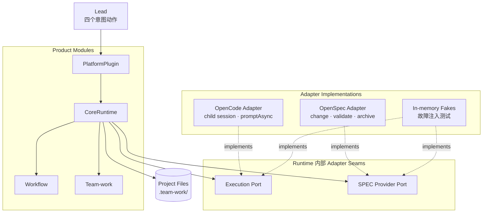

# Runtime v2 软件架构

状态：已通过 Standards 与 Spec/架构两轴交叉终审，并于 2026-08-18 取得人工确认，可进入规划与实施。v2 不兼容 v1，不为旧命令、旧 schema 或旧任务状态提供运行时兼容层。

本文定义 `team-work-runtime` 下一版的目标软件架构。它替换现有 `task/context/flow/work/event` 命令族、LeadController 编排层和 OpenCode Adapter 内的第二份会话状态机。实现前必须先通过本文的人工设计审核。十阶段正常、分支、成本和恢复演化见 [`runtime-v2-workflow-simulation.md`](runtime-v2-workflow-simulation.md)。

## 1. 重构目标

v2 只解决一个核心问题：提供一个可恢复、可审计、跨平台的 multiagent engineering loop，同时让 Lead 只处理少量、语义明确的信息。

必须达到：

- Lead 正常只使用 `open / plan / run / steer` 四个动作；
- Lead 不接触 revision、gate、work-item 生命周期、session、spawn/resume、SPEC 命令或恢复步骤；
- Lead 默认只接收短 ActionCard，但可按需读取决策包、相关制品和证据；“默认不注入”不等于“禁止访问”；
- Lead 是流程控制者，不直接执行具体工作或冒充技术裁决；遇到分歧时可要求 Owner 解释/返工、补充证据、重新挑战，并主动请求独立 Expert 仲裁；
- Runtime 持有唯一控制状态，负责阶段流转、工作图、门禁、派发事务、恢复和上下文投影；
- Workflow 与 Team-work 的稳定规则机器化，不能继续主要依靠 Lead 阅读长 Skill 后手工编排；
- 成员始终后台执行，通过结构化报告交付，完整会话和工具输出不得回灌 Lead；
- 允许从任意研发阶段介入，只检查当前阶段最低输入；
- 人工等待是静止状态；无模型轮询、定时推进或后台 continuation；
- OpenCode、Claude Code 等平台差异只存在于 Platform Adapter；
- OpenSpec、spec-kit 等差异只存在于 SPEC Provider Adapter；
- 默认 Lead 工作流上下文目标不超过约 1500 tokens。

不做：

- v1 状态迁移或兼容命令；
- N-to-N 消息总线；
- 常驻 daemon、数据库或分布式调度；
- Runtime 代替 Owner、挑战者或 Expert 做技术判断；
- 通过新增包装层继续调用 v1 控制面。

## 2. 现有架构的根因

当前实现的问题不是工具数量本身，而是控制职责分裂：

1. CoreRuntime 暴露 `task.* / context.* / flow.* / work.* / event.*` 三十余个命令；
2. LeadController 再把部分命令拼成 `begin / dispatch / assess / continue / sync`；
3. OpenCode Adapter 另外维护 session mapping、dispatch sequence、pending sync、OpenSpec 生命周期和恢复提示；
4. Workflow 与 Team-work 仍要求 Lead 阅读策略、选择命令、组织工作项并判断何时同步；
5. 成员消息通过 `session.messages` 完整返回，工具输出和历史消息进入 Lead 上下文。

结果是三个浅 Module 叠加：复杂性没有消失，只是转移给 Lead，并在 CoreRuntime、LeadController 和 PlatformPlugin 三处重复维护。

v2 必须替换这些层，而不是再增加一层 Facade。

## 3. 方案比较与选择

### 方案 A：单一 `act(intent)`

优点是 Interface 最小，所有行为隐藏在 Runtime。问题是 start、阶段规划、人工答复和恢复会形成大型 union；工具参数错误会重新集中到一个万能入口，和当前通用 Runtime Tool 的失败模式相似。

### 方案 B：`dispatch / reconcile / continue`

优点是事务语义清楚，容易测试。问题是 Lead 仍需理解何时派发、何时回收、何时推进，本质上仍在做机械编排。

### 方案 C：完全自动的 ActionCard

优点是默认体验最简单。问题是语义规划来源不清晰：Runtime 不能凭确定性代码理解复杂需求、拆分工作或决定风险偏好。

### 采用方案：四个强类型意图

```text
open → plan → run
         ↑      ↓
         └─ steer（人工决定或必要的受控干预）
```

- `open` 负责创建、恢复、绑定和任意阶段介入；
- `plan` 负责提交当前阶段的语义目标、约束和少量执行偏好；
- `run` 负责运行到稳定点，内部吞掉派发、等待、回收、审查、返工和确定性流转；
- `steer` 负责回答 Runtime 给出的选择，或在确有技术分歧时请求受控的 Owner、挑战者、取证和 Expert 动作。

四个工具各自有小而严格的 schema，避免万能命令；正常主循环只重复 `run`，`steer` 是低频例外，不得退化为通用 Runtime 命令入口。

## 4. 静态架构与依赖方向

四个 Product Module 的产品边界以 [`AGENTS.md`](../AGENTS.md) 为唯一事实源，本节不重新定义职责，只规定 v2 的静态依赖与 Adapter seam；若措辞与 AGENTS 冲突，以 AGENTS 为准。



关键依赖反转：

- v1 是 Workflow/Team-work 经由 Lead 调 Runtime；
- v2 是 Lead 调 Runtime，Runtime 调机器化的 Workflow 与 Team-work Policy；
- PlatformPlugin 是薄 Adapter 和 composition root，不再拥有流程状态或恢复决策；
- OpenSpec 从 OpenCode Adapter 中拆出，成为独立 SPEC Provider Adapter；
- Runtime 只依赖 Adapter Interface，不依赖 OpenCode 或 OpenSpec Implementation。

本图只表达依赖：Lead 经 PlatformPlugin 调用 Runtime；Runtime 消费 Workflow/Team-work 的机器化 Policy，并只通过 Execution/SPEC Adapter Interface 接触可变外部实现。

## 5. 面向 Lead 的唯一 Interface

PlatformPlugin 可以映射为四个独立工具；Interface 中的 request ID、revision、会话绑定和幂等键都由 Plugin/Runtime 生成，模型不传。

```ts
interface LeadControl {
  open(input: OpenIntent): Promise<RuntimeCard>
  plan(input: PlanIntent): Promise<RuntimeCard>
  run(): Promise<RuntimeCard>
  steer(input: SteeringIntent): Promise<RuntimeCard>
}

type RuntimeCard = ActionCard | ProblemCard
```

公共制品引用区分项目文件和只读外部事实，避免把 Git 范围或资料链接伪装成可写路径：

```ts
type ArtifactRef = {
  kind: string
  locator:
    | { type: "project-path"; value: string }
    | { type: "git-revision"; value: string }
    | { type: "external-uri"; value: string }
  summary?: string
}
```

只有 `project-path` 可以成为成员输出和 fingerprint 对象；Git revision 与 external URI 只能作为只读输入证据。

可靠性门禁引用 Runtime 注册的 EvidenceRecord，不直接相信成员自然语言声称“已测试”或“已验证”：

```ts
type EvidenceRecord = {
  evidenceId: string
  kind:
    | "artifact-digest"
    | "platform-check"
    | "spec-provider"
    | "human-decision"
    | "external-fact"
    | "member-assertion"
  sourceRef: string
  artifactRefs?: string[]
  result?: "pass" | "fail" | "unknown"
  digest?: string
  observedAt: string
}
```

Workflow 的硬门禁声明最低证据等级：制品存在使用 artifact digest，测试通过优先使用 Platform Adapter/Hook 观测到的命令结果，SPEC 使用 Provider validation，人工门禁使用已验证的人工决定凭证。`member-assertion` 只能作为线索或风险说明，不能单独满足测试、Expert 裁决或人工批准门禁。平台不能提供 check receipt 时必须通过独立复验或显式暴露未验证风险，不能静默提升证据等级。

### 5.1 `open`

```ts
type OpenIntent = {
  taskId?: string
  title?: string
  objective?: string
  entryStage?: string
  completion?:
    | { mode: "workflow" }
    | { mode: "through-stage"; stage: string }
  existingArtifacts?: ArtifactRef[]
}
```

规则：

- 无任务时创建；有会话绑定时恢复；显式 taskId 优先；歧义时拒绝猜测；
- entryStage 可以是 Workflow 声明的任意阶段；
- `completion=workflow` 运行到 Workflow 的正常终点；`through-stage` 只运行到用户请求的验收里程碑，适用于 standalone 团队讨论、单独代码 Review、补测试等局部任务；
- PlatformPlugin/Skill 根据用户目标设置 completion：Workflow 默认 `workflow`，直接 Team-work 默认当前请求对应的验收阶段；不得因为从中间阶段介入就擅自跑完整十阶段；
- Runtime 从固定版本 Workflow 投影 `entryStage → completion` 子图。目标阶段已有适用人工门禁时，该门禁同时完成局部任务验收；否则生成一次 scoped final acceptance，禁止连续出现两个等价人工门禁；
- entryStage 与 completion 在任务创建后不可变。局部任务完成后若用户要求继续后续研发，创建一个引用既有制品的新任务并从下一实际阶段介入；不在已完成任务上扩张范围或重写审计语义；
- 只校验 entryStage 的最低输入；不要求历史方案、SPEC、测试或 Review；
- 同一输入可幂等重试；
- 已有任务时不要求重复 title、entryStage 等创建参数；
- 返回当前 ActionCard；它同时承担只读 overview，因此不再提供独立 Lead 状态工具。

### 5.2 `plan`

`PlanIntent` 只表达任务目标、约束和偏好，不要求 Lead 设计工作包。它作为持久 TaskIntent 被后续阶段继承；Lead 可以根据用户输入和已有事实形成该意图，但不得因此亲自承担代码探索、方案设计或任务拆分。

```ts
type PlanIntent = {
  objective: string
  constraints?: string[]
  exclusions?: string[]
  preferences?: {
    execution?: "auto" | "solo" | "team"
    budget?: "economy" | "balanced" | "quality"
    risk?: "normal" | "high" | "critical"
  }
}
```

Lead 不提供：输出路径、工作包、依赖图、Agent 名称、Owner、挑战者、Expert、session ID、prompt、context profile、gate、work-item ID、SPEC 路径规则、轮数或重试策略。

Runtime 以 planning bootstrap 形成可执行计划：

1. Workflow 提供当前阶段的默认制品合同、最低输入和合法边；
2. 简单、单一产物且边界明确的阶段可由确定性模板生成单工作包草案；
3. 需要探索、并行、复杂拆分或高风险判断时，Runtime 创建 `assignmentKind=planning` 的受管 Owner，形成结构化 `StagePlanProposal`；
4. 规划 Owner 默认使用满足任务上限的低成本档位；必要时由非作者 Challenger 检查遗漏、冲突和不可执行边界，核心或高风险规划再由 Expert 把关；
5. Runtime 校验产物引用、依赖无环、Owner 唯一性和阶段合同；Team-work 补齐最低充分的角色、成本和收敛拓扑；
6. 校验通过后冻结不可变 `StagePlan`，并向 Lead 返回简短计划摘要和完整提案引用。

`StagePlanProposal` 是成员制品，不是 Lead Interface。它至少包含阶段目标、输入、输出、工作包、验收条件和依赖关系。Policy Compiler 只校验、规范化并补充策略，不能靠确定性代码臆造复杂技术分解。Lead 如需判断计划是否偏离用户意图，可以按需读取提案制品，并通过 `steer` 要求 replan 或增加约束。

`plan` 原子保存 PlanIntent 后调用同一个 Task Driver 运行到稳定点。简单计划可立即返回冻结后的摘要；需要规划 Owner/Challenger/Expert 时，`plan` 可以像 `run` 一样在等待预算内接收报告，超出预算则返回 `wait`，后续 `run` 继续。Lead 不负责轮询或手工完成 planning bootstrap。

每个 stage run 仍有独立、不可变的 StagePlan，但阶段推进后 Runtime 必须从 TaskIntent、Workflow、已验收制品和当前证据自动生成下一阶段计划；只有用户目标/约束变化、真实业务分支或自动规划无法消歧时才再次返回 `next.kind=plan/steer`。Lead 不为十个阶段重复填写 PlanIntent。

Workflow 和 Team-work 将 PlanIntent 编译为不可变 `StagePlan`：

- Workflow 补齐阶段最低输入、产物合同、合法边和人工点；
- Team-work 选择最低充分的 Junior/Senior/Expert 拓扑；
- 每个工作包生成唯一 Owner；
- 每个完整工作包生成非作者挑战位；
- 挑战位默认至少为 Senior；
- 核心阶段生成非作者 Expert 裁决位；
- 最大自主收敛轮数不超过三轮；
- Agent 从 Platform Adapter 提供的规范化能力目录中选择。

`plan` 返回的 ActionCard 必须展示简短执行摘要：目标、主要产物、solo/team、Owner 数量、挑战者档位、是否使用 Expert，以及按 `Junior:Senior:Expert = 1:10:50` 计算的成本区间、已消耗和下一波成本。Lead 可以据此核对计划是否符合用户意图，但不手工挑选具体 Agent。关键攻坚允许 Expert 成为 Owner；此时核心交付仍需另一位非作者 Senior/Expert 复核，不能让 Expert 自审。

已经开始执行的 StagePlan 不可静默修改。新的用户约束会先产生 replan 决策卡，确认后创建新的 stage run；旧派发和证据只保留审计价值。

### 5.3 `run`

`run` 没有面向 Lead 的参数。等待预算、abort signal 和 host call ID 由 PlatformPlugin 注入。Runtime 执行 run-to-quiescence：

1. 恢复未完成事务并对账平台效果；
2. 根据当前 StagePlan 推导唯一下一动作；
3. 原子记录派发意图；
4. 通过 Execution Adapter 创建或恢复后台成员；
5. 等待平台事件或结构化成员报告；
6. 校验制品、角色独立性、挑战链和 Expert 裁决；
7. 自动进行有界返工或下一波协作；
8. 满足当前阶段时选择唯一确定性流程边；
9. 遇到人工门禁、真实分支、三轮未收敛、不可安全恢复或任务完成时返回 ActionCard。

等待发生在 Runtime/Platform Adapter 内，不由模型定时调用状态工具。用户输入可以中断挂起调用；中断只停止等待，不破坏已经持久化的状态。宿主重启后，下一次 `open/run` 先对账再继续。

### 5.4 `steer`

```ts
type SteeringIntent = {
  action:
    | "choose"
    | "owner-explain"
    | "owner-rework"
    | "collect-evidence"
    | "challenge-again"
    | "expert-arbitrate"
    | "second-expert-opinion"
    | "replace-owner"
    | "replan"
    | "escalate-to-user"
  directive: string
  targetRef?: string
  referenceRefs?: string[]
  note?: string
}
```

- 采用一个扁平对象和固定 action enum，避免复杂 `oneOf`/嵌套 union 降低不同模型的工具调用成功率；Runtime 按 action 校验字段组合；
- `choose` 用于人工批准、驳回、有限追加轮次、取消和 Runtime 已列出的流程选择；`directive` 必须等于 ActionCard choice 的 value；
- 其他 action 是流程级受控干预，不是底层命令；`directive` 表达问题、理由或期望裁决，`targetRef/referenceRefs` 只能引用当前 DecisionPacket 暴露的对象；
- 受控干预只允许要求已有 Owner/挑战者继续履责、补充证据、replan 或请求独立 Expert；Lead 不提交 Agent、模型、session、work-item、gate 或 Runtime 状态字段；
- Runtime 为当前 ActionCard 维护内部 steering token，并绑定 task、stage run、制品 fingerprint、允许的 choices 和可干预范围；PlatformPlugin 根据当前会话自动附加，Lead 不读取或传递；
- 过期 steering、变化后的制品、非法目标、违反独立性/成本/轮数策略的动作一律拒绝；
- 人工批准必须携带请求之后的有效决定凭证：平台模式由 Adapter 验证真实用户消息，standalone 模式只接受不向 Agent 暴露的 trusted-caller 入口；
- 普通推进仍由 `run` 完成；`steer` 不能用于手工派发、回收、改状态、绕过门禁或替代 Runtime 恢复；
- `next` 是 Runtime 给出的唯一推荐动作。`choose` 只在 `next.kind=steer` 时有效；其他 action 可在稳定 ActionCard 上作为受控例外提交，成功后立即使旧 Card 失效并产生新的工作计划；非稳定状态先由 Runtime reconcile 到稳定点；
- Lead 不得用 `steer` 给出自己的技术裁决。需要关键技术结论时必须请求 `expert-arbitrate`；同一争议需要独立复核时请求 `second-expert-opinion`；
- 一位满足当前成本策略的 Expert 仲裁默认不要求用户再次批准；新增高成本第二 Expert 超出任务预算时，Runtime 先生成用户成本选择；
- Lead 不传 gate ID、actor、evidence ID、return edge 或内部 decision token。

### 5.5 Expert 仲裁闭环

Expert 仲裁是 Lead 的保留调度权，但执行与会话管理仍完全由 Runtime 负责：

1. Lead 在分歧或关键技术决策上提交 `expert-arbitrate`；
2. Runtime 校验当前稳定点、争议引用、预算和角色独立性，创建 Expert assignment；
3. Context Composer 向 Expert 注入当前 DecisionPacket、相关制品和证据，不注入无关历史；
4. Expert 可以返回 `need-more-evidence`；Runtime 随后创建低成本 research/test Owner assignment，并在证据到齐后恢复同一 Expert session；
5. Expert 提交结构化 `ExpertVerdict`，Runtime 验证引用、独立性和制品指纹；
6. Runtime 更新 DecisionPacket，Lead 再选择 Owner 辩解/返工、重新挑战、第二意见或用户裁决；
7. 同一仲裁链默认复用同一 Expert session；第二意见必须使用新的独立 Expert，优先选择不同模型以减少相关偏差。

```ts
type ExpertVerdict = {
  outcome:
    | "accept"
    | "rework"
    | "choose-option"
    | "need-more-evidence"
    | "escalate-to-user"
  rationale: string
  evidenceRefs: string[]
  affectedScope: string[]
  risks: string[]
  confidence: "low" | "medium" | "high"
  recommendedAction: string
}
```

Expert 裁决不是不可质疑的绝对权威。Owner 必须独立核验，可以接受，也可以带证据提出异议；异议进入下一轮并再次交非作者角色复核。自主讨论最多三轮，之后必须交给用户，用户可显式批准有目标和预算的有限追加轮次。

## 6. ActionCard：Lead 的唯一工作视图

所有四个动作返回同一结构：

```ts
type ActionCard = {
  cardId: string
  task: {
    id: string
    title: string
    stage: string
    stageLabel: string
    status: "needs-plan" | "working" | "awaiting-user" | "blocked" | "completed" | "cancelled"
  }
  report: {
    completed: string[]
    current: string
    conclusions: string[]
    artifacts: Array<{ label: string; path: string; kind: string }>
    risks: string[]
    disagreement?: string
    team?: {
      mode: "solo" | "team"
      owners: number
      challengerTier: "senior" | "expert"
      expert: boolean
      cost: {
        forecastMin: number
        forecastMax: number
        accrued: number
        nextWave: number
        automaticLimit: number
      }
    }
  }
  decision?: {
    summary: string
    packetRef: string
  }
  next:
    | { kind: "plan"; instruction: string }
    | { kind: "run"; instruction: string }
    | {
        kind: "steer"
        question: string
        choices: Array<{
          value: string
          label: string
          impact?: string
          relativeCost?: number
        }>
      }
    | { kind: "wait"; instruction: string }
    | { kind: "none" }
}
```

强约束：

- `next` 只能有一个动作；
- 唯一下一步约束表示默认路径没有并列操作；5.4 定义的受控干预是显式覆盖，不得被 Skill 描述成每轮必做步骤；
- `wait` 表示当前模型回合立即停止，不得循环调用 `run`；挂起调用由平台事件唤醒，若宿主等待预算已结束，则由下一次用户/宿主激活后再 `open/run` 恢复；
- conclusions 最多 3 条，risks 最多 3 条，artifacts 默认最多 5 条；
- ActionCard 目标不超过约 700 tokens，完整 Lead 注入目标不超过约 1500 tokens；无 tokenizer 时 ActionCard 使用 2000 Unicode code points 硬上限；
- 超额时先移除历史阶段摘要、非关键制品和低风险项；
- 当前人工问题、未解决分歧、关键制品和唯一下一步不得被截断；
- 不包含 revision、schema、锁、gate ID、work-item ID、session ID、dispatch sequence、pending sync、原始成员对话、工具输出、完整测试日志、模型池或 OpenSpec 命令；需要更详细判断时只提供 DecisionPacket 引用；
- 路径由 PlatformPlugin 渲染成当前 CLI 可点击形式。

Context Composer 使用模型无关的确定性字符预算，而不是用字符数假装精确 token 数：

```text
metadata + team summary       120 code points
completed                     240
current                       160
conclusions                   300
artifact labels/links         480
risks + disagreement          300
next action                   300
reserved                       100
hard total                   2000
```

约 700/1500 tokens 只是有 tokenizer 的 Platform Profile 上持续测量的体验指标，允许按模型记录偏差，不作为跨模型正确性条件。2000 code points、条目数量和字段预算是所有平台必须通过的契约。单个不可截断字段超限时，Runtime 把完整内容写入当前任务的只读 overflow artifact，ActionCard 只保留短结论和可点击引用；无法安全生成引用时返回 `CONTEXT_BUDGET_EXCEEDED` ProblemCard，不能静默截断人工问题、分歧或关键制品。

Lead 对用户只需转述 ActionCard 的研发含义：完成了什么、当前阶段、关键制品、风险/分歧和下一步。

### 6.1 默认注入与按需可读不是同一边界

ActionCard 是默认注入，不是 Lead 能访问的全部信息。Lead 为推进流程可按需读取：

- 当前 DecisionPacket；
- 已注册的方案、SPEC、代码、测试和 Review 制品；
- Owner、挑战者、Expert 的结构化报告；
- 与当前分歧直接相关的源码和测试事实。

默认不向 Lead 注入完整制品、原始会话、工具日志和历史轮次。若理解细节需要大范围代码探索、资料检索或测试，Lead 应通过 `steer` 委托取证，不得自己转化为具体工作 Owner。

### 6.2 DecisionPacket：低频判断视图

Runtime 在存在分歧、返工选择、Expert 仲裁或用户决策时生成只读 DecisionPacket，保存到当前任务的 `packets/` 目录。它是结构化投影，不是新的事实源；完整事实仍来自制品、报告和证据引用。

```ts
type DecisionPacket = {
  packetId: string
  version: number
  factsDigest: string
  question: string
  stage: string
  roster: Array<{
    memberRef: string
    role: "owner" | "challenger" | "expert"
    assignmentKind: AssignmentKind
    tier: "junior" | "senior" | "expert"
    modelLabel?: string
    status: string
  }>
  claims: Array<{
    authorRef: string
    statement: string
    evidenceRefs: string[]
  }>
  rounds: Array<{
    round: number
    outcome: string
    resolved: string[]
    unresolved: string[]
  }>
  expertVerdictRef?: string
  ownerResponseRef?: string
  artifactRefs: string[]
  choices: Array<{
    value: string
    label: string
    impact?: string
    relativeCost?: number
  }>
}
```

约束：

- 只保留支持当前判断的结论、证据、角色和轮次，不复制原始 transcript；
- `version` 在同一问题的 packet 更新时递增，`factsDigest` 绑定生成该投影的报告、制品和证据事实；
- 记录成员角色、成本档位和模型标签，便于 Lead 判断是否需要更换 Owner、增加异质模型或请求第二意见；
- 已解决项与未解决项必须分开，不能让历史争论淹没当前问题；
- packet 变化生成新版本，旧版本只供审计；ActionCard 只链接当前版本；
- 普通 `run` 路径不自动注入 packet，Lead 只在需要判断时读取。

### 6.3 Lead 权限边界

允许：

- 使用 `open / plan / run / steer` 控制任务；
- 读取 ActionCard、DecisionPacket、注册制品、结构化报告及当前问题相关源码/测试；
- 与用户沟通目标、约束、阶段结果、风险和决策；
- 要求 Owner 解释或返工、补充证据、重新挑战、replan、更换 Owner；
- 主动请求 Expert 仲裁、第二 Expert 意见，或把三轮未收敛和重大业务取舍交给用户。

禁止：

- 直接创建、恢复或选择 child session/subagent；
- 直接选择具体模型和成员，或调用 Runtime、SPEC、平台底层命令；
- 直接编写源码、设计、SPEC、测试、Review 等任务制品；
- 冒充 Owner、挑战者或 Expert 给出最终技术裁决；
- 绕过角色独立性、成本预算、三轮上限、人工门禁和证据校验。

因此 Lead 是流程权威和问题路由者，不是技术 Owner；Expert 是关键技术裁决者；Runtime 是状态、规则和执行机制的权威。

## 7. Agent 视角、权限与边界

角色、成本档位和工作场景是三个独立维度，不能混成一组 Agent 类型：

```ts
type TeamRole = "owner" | "challenger" | "expert"

type AssignmentKind =
  | "planning"
  | "research"
  | "design"
  | "spec"
  | "implementation"
  | "integration"
  | "test"
  | "review"
  | "e2e"
  | "evidence"
  | `custom:${string}`

type CostTier = "junior" | "senior" | "expert"
```

- `junior-flash`、`senior-qwen`、`expert-opus` 等是 Platform Agent/模型与成本配置，不是团队责任角色；
- Planner、Researcher、Implementer、Integrator、Tester、Reviewer 都是 assignment kind 或场景分工，不新增永久角色；Team-work 场景模板决定由 Owner、Challenger 或 Expert 承担，例如实现通常由 Owner 承担，代码 Review 通常由 Challenger/Expert 承担；
- 正式团队收敛只包含 Owner、Challenger、Expert。Lead 属于控制面，Helper 属于团队外辅助能力，都不进入团队角色计数、互评或技术裁决链。

| 视角 | 主要责任 | 允许 | 禁止 |
| --- | --- | --- | --- |
| Lead | 保持用户目标和流程连续；核对制品、证据与复核链；路由分歧并向用户简明汇报 | 使用四动作 Interface；读取 ActionCard、DecisionPacket 和相关事实；要求解释、返工、补证、重审或 Expert 仲裁 | 亲自承担技术工作；直接写任务制品；选择/恢复 session；冒充技术裁决；绕过 Runtime 状态与门禁 |
| Owner | 对一个 assignment 的范围、完成条件和制品端到端负责；先理解、执行、自检，再回应审查 | 读取 assignment 声明的上下文；修改声明的 writable scope；运行必要工具和测试；调用只读 Helper；提交制品、证据和结构化报告；用证据接受或反驳意见 | 修改其他 Owner 范围或流程状态；自行验收自己的工作；隐藏 blocker；创建团队成员；同时担任同一制品的 Challenger/Expert |
| Challenger | 作为非作者主动找漏洞，覆盖需求、事实、推理、边界、成本、代码质量、性能、稳定性和失败路径 | 读取目标制品及必要事实；执行不改变产品制品的验证；提交带证据的问题、影响和最小修正建议；复查 Owner 的回应 | 直接修改被审制品；替 Owner 完成返工；无证据否定；把偏好伪装成 blocker；对自己参与创作的同一制品保持 Challenger 身份 |
| Expert | 在核心环节或重大分歧中给出关键技术裁决，并明确证据、风险、置信度和后续动作 | 读取争议所需的广泛制品与证据；要求补充 research/test 证据；提交 ExpertVerdict；必要时通过独立 assignment 亲自担任复杂工作 Owner | 控制流程状态或人工门禁；无证据凭模型权威裁决；否定 Owner 的证据异议权；裁决自己作为 Owner 产出的同一制品 |
| Helper | 为某个受管成员快速提供代码探索或外部资料结果 | 在给定范围内只读检索；把原始结果返回调用成员 | 修改文件；成为 Owner；直接向 Runtime 交付；继续委托；参与收敛、评分或裁决 |

### 7.1 角色不变量

1. 每个 assignment 只有一个 TeamRole 和一个受派成员；每个产出型工作包只有一个唯一 Owner；角色、assignment kind、成本档位分别记录；
2. Owner 可以使用 Junior、Senior 或 Expert 档位；Challenger 默认至少 Senior；核心裁决位使用 Expert 档位；
3. Expert 可以亲自攻坚，但此时它在该 assignment 中是 Owner，必须由另一位非作者 Challenger/Expert 复核；
4. 成员换职责、接手他人范围或从审查转实施时创建新 assignment；Runtime 保存关联，但不沿用会破坏独立性的角色身份；
5. 同一制品的作者、挑战者和裁决者必须独立。相同 session 不得跨越作者与审查/裁决角色；第二 Expert 意见必须使用新的独立成员；
6. Challenger 报告问题不等于返工成立，Expert 裁决也不等于绝对真理；Owner 必须核验，证据分歧按最多三轮协议收敛；
7. “代码 Reviewer”“测试专员”“方案 Planner”等细分只存在于场景模板和 assignment scope，不进入 Platform Agent 的永久提示词；assignment kind 不隐含 TeamRole；
8. Scorer 不是运行角色。可选评分由当前参与者在收敛后完成，只用于后续选模，不改变本次验收结果。
9. 多 Owner 并行交付需要合并、冲突消解或统一表述时，工作图必须创建明确的 integration Owner；Lead 不负责手工整合技术制品。
10. 挑战链只包围产品/方案/SPEC/测试等被交付制品，不递归包围 Challenger 报告或 ExpertVerdict。审查发现由原制品 Owner 回应，Expert 裁决该争议，从而闭合链路而不产生“审查报告再审查”的无限递归。

独立性的最低标准是不同成员与不同 session；候选池允许时，Challenger、Expert 和第二 Expert 应优先使用与 Owner 不同的模型。`custom:*` assignment kind 必须来自当前固定版本的 Workflow Definition，Lead 和成员不能临时发明。

用户也不是 Agent。用户拥有方案批准、最终验收、三轮后裁决、重大业务取舍和额外高成本预算授权；Runtime 必须先静止任务并验证人工决定凭证，任何 Agent 都不能代签。

### 7.2 不新增的永久角色

- Planner、Researcher、Implementer、Integrator、Tester、Reviewer：是 assignment kind 或场景标签，不是永久角色；其中 planning/implementation/integration 通常映射 Owner，review 通常映射 Challenger/Expert，test 可按“编写测试”或“独立复验”分别映射 Owner/Challenger；
- Arbiter：是 Expert 在争议场景下的工作模式；
- Coordinator、Reporter、Synthesizer：流程协调属于 Lead，确定性汇总投影属于 Runtime，不能再创建一个会改写技术结论的中间角色；
- Scorer：是收敛后的可选动作；
- Helper：是唯一额外视角，但它没有 TeamRole、assignment 和直接交付权。

### 7.3 成员 Interface

成员不是 Lead Interface 的调用者。受管成员只获得一个结构化交付动作；task、stage、assignment、role 和 session 绑定由 Runtime 注入，不由成员传递。

```ts
interface MemberDelivery {
  report(input: MemberReport): Promise<MemberReceipt>
}

type MemberReport = {
  outcome: "delivered" | "rework" | "blocked" | "needs-user"
  summary: string
  artifacts: Array<{ ref: string; path: string }>
  evidenceRefs: string[]
  unresolved?: string[]
  checks?: Array<{
    name: string
    result: "pass" | "fail" | "not-run"
    evidenceRef?: string
  }>
  findings?: Array<{
    severity: "info" | "risk" | "blocker"
    statement: string
    evidenceRefs: string[]
  }>
  recommendation: "accept" | "rework" | "escalate"
  verdict?: ExpertVerdict
}

type MemberReceipt = {
  reportId: string
  observationId: string
  assignmentId: string
  accepted: boolean
  duplicate: boolean
  stateRevision: number
}
```

PlatformPlugin 用稳定 host tool-call ID 生成 report operation key；同一成员工具调用重试返回同一 MemberReceipt。成员不填写 reportId、assignmentId、attempt、role 或 stageRunId，Runtime 从受管 session binding 中取得并校验。

权限不能只靠提示词约束。StagePlan 必须为每个 assignment 固定 readable refs、product writable refs、允许的工具能力和 report contract；Platform Adapter 按这些能力提供执行环境，Runtime 根据绑定角色应用不同校验：

- Owner 只能修改 assignment 的 product writable refs，必须给出声明产物、完成条件、自检证据和未解决问题；
- Challenger 没有 product writable refs，只能通过 MemberDelivery 提交发现；目标产品制品在挑战期间发生变化时，当前审查失效并重新绑定 fingerprint；
- Expert 没有 product writable refs，只能通过 MemberDelivery 提交 ExpertVerdict；必须给出 `accept / rework / choose-option / need-more-evidence / escalate-to-user`、证据、风险和置信度；
- Helper 没有 MemberDelivery binding，不能直接提交 report；调用成员必须核验后将其结果转化为自己的证据；
- 作者不能审查自己；核心阶段缺少 Expert 报告不得通过；
- 平台 idle、消息送达或成员文本声称完成都不等于 report；
- idle 且无 report 时，Runtime 最多进行有界纠正续派，之后形成明确 blocker；
- Runtime 只验证结构、路径、证据链和角色规则，不判断技术结论真假。

权限采用纵深校验：Platform Adapter 优先通过工具能力和 Hook 阻止未授权写入，Runtime 再依据 assignment 前后的产品制品 fingerprint 验证。平台无法物理限制写入时，任何越权变化都必须使报告拒绝或审查失效，不能仅记录警告后继续推进。

成员可按 Platform Adapter 能力临时调用只读 explore/librarian helper；helper 不成为 assignment Owner，不进入挑战、裁决或评分，也不能修改文件或继续委托。helper 的原始输出只返回调用成员，由成员核验后写入自己的结构化报告。

完整 session 消息永远不进入 LeadCard。必要诊断只能由人工显式进入 diagnostic mode 查看。

## 8. CoreRuntime 内部 Module

CoreRuntime 对外是一个深 Module，内部可以拆分为高内聚实现；这些内部 Module 不形成 Lead Interface。

```text
Lead intent / member report / platform observation
                    │
                    ▼
             Runtime Facade
                    │
                    ▼
              Task Driver
        ┌───────────┼───────────┐
        ▼           ▼           ▼
  Task Aggregate  Policy     Effect Coordinator
    + Reducer     Compiler     + Reconciler
        │           │           │
        └───────────┼───────────┘
                    ▼
             Transactional Store
```

### 8.1 Runtime Facade

- 实现 `LeadControl` 和 `MemberDelivery`；
- 解析当前任务和会话绑定；
- 根据稳定 host call ID，或 `task + cardId + action digest`，确定性生成内部 operation ID；
- 将 `steer` 校验为当前稳定点允许的流程动作，不把自由文本直接翻译成状态变更；
- 所有入口先执行 reconcile；
- 返回 ActionCard 或稳定 ProblemCard。

### 8.2 Task Aggregate 与 Reducer

- `state + fact -> next state + effects`，尽量保持纯函数；
- 独占任务、stage run、work graph、round、report refs、gate、steering、Expert intervention 和 DecisionPacket refs 状态；
- 负责合法流转和不变量，不执行 I/O；
- Workflow 阶段是数据，不在 reducer 中硬编码十阶段名称；
- 重新进入、自循环或返工时创建新的 stageRunId，旧交付不能满足新门禁。

### 8.3 Policy Compiler

- 读取版本固定的 Workflow Definition；
- 读取 Team Policy Catalog；
- 读取 Execution Adapter 的规范化 Agent Catalog；
- 用 Workflow 默认合同或已验证的 StagePlanProposal，把 PlanIntent 编译为不可变 StagePlan 与 WorkGraph；
- 只生成确定性简单计划；复杂技术拆分必须来自 `assignmentKind=planning` 的受管 Owner 所提交的结构化 proposal；
- 校验 Lead 干预的目标、角色独立性、预算和轮次上限；
- 不访问文件、不派发、不写状态。

V2-4 将这个内部 seam 落为纯函数组合：`compilePolicyPlan` 负责装配，Workflow Compiler 只解释版本固定的工程流程、当前阶段合同及 SPEC/E2E 决定表，Team-work Compiler 只解释成本、角色、拓扑和收敛策略。输入 Policy、StagePlanProposal 与规范化 Agent Catalog 均先通过版本化 Schema；输出中的 Workflow/Team/Agent Catalog pin、路由决定和三轮上限随 StagePlan 一起冻结。复杂阶段先生成低成本 planning bootstrap，只有带内容 digest 的结构化 proposal 才能形成正式工作图。

Planning bootstrap 与 E2E 适用性评估是两种显式 `preflight`，不是可冻结的正式 StagePlan。Compiler 分别返回 `planning-bootstrap` 或 `route-assessment`，其结果经 V2-5 的 Driver 持久执行并验收后，Compiler 才能用 proposal 或 assessment 生成唯一的 delivery StagePlan；Domain 明确拒绝把带 `preflightKind` 的工作图冻结为阶段计划。这样既保留前置工作的 durable execution，也不破坏“每个 stage run 的正式 StagePlan 一次冻结、执行中不可替换”的约束。

TaskIntent 是 Task Aggregate 的持久、带 revision 的事实：第一次 `plan` 前规范化写入，后续阶段 Compiler 默认继承；StagePlan 仍按 stage run 不可变。用户目标或约束发生变化时必须走受控 `replan`，由一个原子事实关闭旧 stage run、保存旧 intent revision 并创建继承新 intent 的 stage run，不得原地修改已经执行的 StagePlan。

### 8.4 Task Driver

- 反复执行 reducer 直到稳定点；
- 内部处理 dispatch、collect、review、rework、advance、SPEC、human wait；
- 不生成技术结论；
- 不在 `awaiting-user` 中运行；
- 不依赖模型轮询。

### 8.5 Effect Coordinator 与 Reconciler

- 每个外部效果先持久化 intent，再调用 Adapter；
- 保存 opaque execution receipt；
- 平台错误分为 retryable、final 和 in-doubt；
- 重启时先 inspect/reconcile，再决定重放、继续或阻断；
- 永远禁止“状态显示 running，但没有已确认 execution receipt”。

### 8.6 Evidence Verifier

- 校验路径留在项目根目录；
- 校验 artifact 存在、fingerprint 和 stageRun 归属；
- 校验产品制品变化未越出 assignment 的 product writable refs；Challenger/Expert 角色不得产生产品写入；
- 校验 Owner/Challenger/Expert 独立性；
- 校验 session binding、TeamRole、AssignmentKind、CostTier 和 report contract 一致；
- 校验人工批准仍绑定当前文件；
- 不解释代码或文档的技术内容。

### 8.7 Context Composer

- 为 Lead 生成 ActionCard；
- 在需要低频判断时生成版本化 DecisionPacket，并只在 ActionCard 中提供引用；
- 为 Owner、Challenger、Expert 和 helper 生成不同最小上下文；
- 使用制品路径和短摘要导航，不复制原始正文；
- 只注入当前 assignment、当前轮次和必要前置报告；
- 旧阶段与旧轮次默认只提供索引。

成员上下文生命周期由 Runtime 决定：同一 assignment 跨返工/讨论轮次默认复用同一 session，续派只补充新报告、证据和本轮目标；职责变化、新工作包、Owner 替换和独立第二意见创建新 session。只有 session 丢失、平台不再兼容或超过平台上下文预算时才轮换执行实例，并用结构化 handoff packet 延续 assignment；该轮换不暴露给 Lead 操作。

### 8.8 Transactional Store

- 继续使用项目文件、文件锁、同目录临时文件和原子 rename；
- 负责 schema、路径安全、事务恢复和审计；
- 不把文件级操作暴露成业务 Interface；
- 事件日志只做审计，不作为状态源。

## 9. Workflow 与 Team-work 的机器化

v1 的 Markdown Skill 同时承担规则、教程和命令手册，导致 Lead 上下文过长。v2 将稳定规则拆成机器可读 Policy，Skill 只保留薄引导。

### Workflow Module

提供：

- 阶段、标签和最低输入；
- 合法边和返工路由；
- 人工门禁；
- SPEC/E2E 路由；
- 每阶段默认制品合同；
- 任意阶段介入规则。

### Team-work Module

提供：

- Junior/Senior/Expert 默认成本权重 `1:10:50` 和选择规则；
- Junior 是常规 Owner 主力；Expert 大多数核心场景保留一个把关位，并可在关键攻坚时亲自成为 Owner；
- solo/team 默认拓扑；
- 方案、实施、测试、Review、E2E 等场景工作图模板；
- Owner、挑战者、Expert 的角色合同，以及 planning/research/implementation/test/review 等 assignment kind 的场景合同；
- Expert 仲裁、补充取证、第二意见和 Owner 证据异议的协作策略；
- 三轮收敛协议；
- 同档模型多样性与并发软上限；
- 可选的同档成员互评；评分只在最终收敛后记录，供后续选模评估，不进入当前任务返工循环；
- 结构化报告和汇报规则。

默认机器 Policy 把代码 Review 的八个必需视角作为 Owner 完成合同，而不是按预算删减视角；E2E 则物化“路径设计 Owner → 独立审查 → 夹具/脚本 Owner → 独立审查 → 执行 Owner → 结果复核 → Expert 裁决”的内部 DAG。审查链到 ExpertVerdict 为止，不再递归审查 Challenger 报告或 ExpertVerdict。

Agent Catalog 的 `agentId` 标识模型/配置候选，不等于成员或执行 session 身份。Owner 与其复核 Expert 必须形成不同 assignment，并由 V2-5/V2-6 在执行时绑定不同 session；优先选择不同 `agentId`/模型族，候选不足时允许复用配置但绝不允许复用作者 session。

### Cost Ledger

Runtime 为任务保存独立于技术状态的相对成本账本：

- `forecastMin/forecastMax` 按 completion 子图、SPEC/E2E 分支、默认拓扑和最多自主轮次估算；分支假设必须可见；
- `nextWave` 在派发前由固定 Agent Catalog 和工作图计算，包含 Owner、Challenger、Expert、integration 与续轮调用；
- `accrued` 记录已经确认发起的模型工作，网关 in-doubt 调用标记为 uncertain，不能假装没有成本；
- `automaticLimit` 是 Runtime 可自主使用的上限；下一波会越界时先进入用户成本选择，不允许 Lead 或 Team-work 静默升级；
- 成本账本只用于预算控制和比较，不冒充供应商精确账单；实际价格与 token 用量可由 Platform Adapter 作为观测附加，但不改变流程正确性。

Team-work 必须选择最低充分拓扑。Review 阶段不递归审查 Review 报告；多个相同视角可合并给同一独立成员，只在范围超出上下文、需要模型差异或确有并行收益时扩员。

### E2E 路由契约

E2E 适用性是一项需要证据的技术评估，不由 Lead 或 Runtime 猜测。进入 E2E 分支前，Runtime 使用 Team-work 模板派发 `e2e-applicability` assessment：Owner 检查用户目标、系统边界、现有测试和可用环境，非作者 Senior/Expert 挑战“可跳过”结论。Runtime 只校验报告结构、独立性和证据 digest，再按固定决策表路由。

```ts
type E2ERouteAssessment = {
  assessmentId: string
  taskId: string
  stageRunId: string
  applicable: boolean
  criticalCrossSystemPath: boolean
  environment: "ready" | "missing" | "unknown"
  evidenceRefs: string[]
  artifactSnapshotDigest: string
  evidenceSnapshotDigest: string
  ownerAssignmentId: string
  challengerAssignmentId: string
  ownerSessionDigest: string
  challengerSessionDigest: string
  ownerReportRef: string
  challengerReportRef: string
  digest: string
}

type E2ERouteState = {
  digest: string
  mode: "auto" | "required" | "disabled"
  userRequired: boolean
  taskIntentDigest: string
  artifactSnapshotDigest: string
  assessmentDigest: string
  decision: "run" | "skip" | "block"
  evidenceRefs: string[]
  reason: string
}
```

`userRequired` 由已固定的 TaskIntent/用户决定投影，不接受成员覆盖。路由规则是：

| mode | 必须执行条件 | environment | Runtime decision |
| --- | --- | --- | --- |
| `disabled` | `userRequired` 或关键跨系统路径 | 任意 | `block`，要求人工解决配置/目标冲突 |
| `disabled` | 否 | 任意 | `skip` |
| `auto` | 否，且 assessment 为不适用 | 任意 | `skip` |
| `auto` | 是，或 assessment 为适用 | `ready` | `run` |
| `auto` | 是，或 assessment 为适用 | `missing|unknown` | `block` |
| `required` | 总是 | `ready` | `run` |
| `required` | 总是 | `missing|unknown` | `block` |

Compiler 必须把 mode、TaskIntent 约束、assessment digest、证据引用和决定物化为 `E2ERouteState`，固定到 `state.json` 和后续 StagePlan。Assessment 必须来自 Runtime 已验证的 Owner/Challenger assignment 与不同 session，并绑定制品及证据快照；只提供字符串结论不能路由。`skip` 必须有可定位证据；`block` 必须给出环境或配置恢复条件；`run` 才能物化下述 E2E 工作图。TaskIntent、assessment 或关联制品 fingerprint 变化时，旧路由失效并必须重新评估。

### E2E 内部工作图

E2E 不是一次“执行测试” assignment。适用时由 Team-work 物化以下内部有向图：

```text
用例/路径设计 Owner
    → Challenger 用例审查
    → 夹具与脚本 Owner 实现
    → Challenger 实现审查
    → 受控环境执行并登记 check receipts
    → Challenger 结果复核
    → 核心/高风险路径 Expert 裁决
```

- 用例、夹具、脚本或结果报告自身的问题留在 E2E 内部创建下一 attempt；
- 发现产品缺陷回 `implementation`，并使后续测试/Review/E2E 证据失效；
- 发现系统性测试策略缺口回 `test`；
- 环境或权限不足进入可恢复 blocker，不得伪造 pass；
- 同一 E2E assignment 跨内部返工复用成员 session，角色变化和独立复核仍创建新 assignment。

### Skill

Workflow Skill 只指导 Lead：

- 什么时候 `open`；
- 如何用当前需求和事实形成轻量 PlanIntent；
- 只按 ActionCard 的唯一下一步行动；
- 必要时如何读取 DecisionPacket，并使用受控 steering 请求取证、返工或 Expert 仲裁；
- 如何把 ActionCard 用朴实语言报告给用户。

Team-work Skill 只补充复杂语义规划建议，不再列举 Runtime 命令、平台工具、恢复步骤或状态字段。成员工作指南由 Runtime 根据角色和场景按需注入，不进入 Lead 上下文。

## 10. 可靠派发与恢复协议

Runtime 与外部 CLI 无法共享 ACID 事务，因此不承诺物理 exactly-once。采用 durable intent + Adapter idempotency + explicit in-doubt：

```text
prepared
   │  state.json 已持久化 operationId 与 effect digest
   ▼
effect-pending
   │  ExecutionAdapter.ensure(operationId, effect)
   ├────────► confirmed ─────► committed
   ├────────► retryable ─────► bounded retry
   ├────────► failed-final ──► blocked
   └────────► in-doubt ──────► inspect(operationId)
```

不变量：

- 相同 operationId + effect digest 返回同一 execution；
- 相同 operationId + 不同 digest 拒绝；
- Adapter 应尽可能通过 operationId 查找已创建 session；
- 平台无法查询时进入 in-doubt，不盲目创建第二个成员；
- 并行 assignment 的 product writable refs 必须互不重叠；无法静态分离时串行执行或先交 integration Owner，禁止依赖成员自行避免覆盖；
- execution handle 由 Runtime 持久化，PlatformPlugin mapping 只是可重建投影；
- 只有 confirmed receipt 才能把 assignment 标为 running；
- 外部调用开始前写入有界 invocation lease；并发 Driver 在 lease 有效期内不得 inspect 或重放，lease 到期后必须先 inspect。lease 只消除“仍在调用”与“宿主已崩溃”的竞争，不代替 operationId 幂等；
- 外部事件只提交 observation/report，不直接推进阶段；
- 新 Runtime 调用或正在挂起的 run 消费事件并驱动 reducer；
- 宿主重启后没有 daemon，下一次 open/run 自动恢复。

成员运行期间检测到用户/外部进程修改受管制品时，Runtime 保留外部改动，将受影响 assignment 标为 stale，并在稳定点重新规划或请求用户决定；不得自动覆盖或回滚。成员失联且留下部分文件但没有有效 report 时，这些文件标记为 unverified，由恢复 Owner 检查、接管或重做，不能因为文件存在就视为交付完成。

### 10.1 Observation Inbox 与唤醒闭环

平台信号不是事实源。所有成员报告和平台 observation 必须先进入 `state.json` 中有序、可重放的 Observation Inbox：

```ts
type ObservationInbox = {
  nextSequence: number
  acknowledgedThrough: number
  items: Array<{
    observationId: string
    sequence: number
    dedupeKey: string
    kind: "member-report" | "execution-idle" | "execution-error" | "execution-lost" | "check-result" | "human-message"
    assignmentId?: string
    executionRef?: string
    payloadRef?: string
    receivedAt: string
  }>
}
```

协议：

1. `MemberDelivery.report` 在同一个文件事务中写入 immutable report、追加 inbox item、递增 state revision；
2. PlatformPlugin 收到 idle/error/lost 等宿主事件时，通过单方法 `PlatformObservationSink.observe` 追加 inbox item；
3. `dedupeKey` 对同一平台事件或 report 稳定，重复提交只返回原 observationId；
4. inbox 提交成功后才触发进程内 SignalHub；SignalHub 只负责唤醒，不承载业务数据；
5. Driver 每次先按 sequence 消费 `acknowledgedThrough + 1` 之后的全部 observation；
6. reducer 产生的状态变化、effects 和新的 acknowledgedThrough 在同一事务提交；
7. 提交前崩溃会重放 observation，reducer 必须按 observationId 幂等；提交后崩溃不会重复产生 effect；
8. 消费完成的 item 可在安全 checkpoint 后压缩到审计日志，但 sequence 和 dedupe 摘要必须保留。

`run` 等待协议：

1. 记录当前 state revision；
2. 重新读取 inbox，已有未消费 observation 时立即继续；
3. 注册 SignalHub waiter；
4. 再次读取 revision/inbox，消除“检查后、订阅前”的竞争窗口；
5. 被 report、platform observation、abort signal 或 host wait budget 唤醒；
6. 唤醒后只重新读取持久状态，不信任 signal payload。

Runtime 的 quiescent predicate 只有以下几类：

- `needs-plan / awaiting-user / blocked / completed / cancelled`；
- 没有可执行的内部 transition、没有未消费 observation、没有 effect-pending/in-doubt，且至少有一个已确认 execution 正在等待 report；
- host wait budget 已结束，此时返回 `wait` Card，不修改业务状态，也不允许 Lead 立即循环调用。

idle observation 不等于 report。Driver 先等待一个由 Platform Profile 配置的短 settle window；窗口内到达 report 则正常消费，窗口结束仍无 report 才生成有界纠正续派。该等待由 Runtime 时钟和 SignalHub 完成，不调用模型、不轮询平台。

### 10.2 人工等待的 prepare-quiesce-commit 事务

Runtime 不能直接把任务写成 `awaiting-user`。进入人工等待必须经过 durable `prepare-await` effect：

```ts
type PendingDecision = {
  decisionId: string
  stageRunId: string
  phase: "preparing" | "awaiting-user"
  requirement: "required" | "optional"
  proofMode: "verified-event" | "trusted-caller"
  capabilitySnapshotDigest: string
  leadBindingRef: string
  question: string
  choices: string[]
  evidence: Array<{ artifactId: string; path: string; digest: string }>
  evidenceDigest: string
  executionRefs: string[]
  quiesceOperationId: string
  quiesceAttempt: number
  observationsAfterPrepare: number
  quiesceReceiptRef?: string
  quiesceFailureRef?: string
  afterHostCursor?: string
  issuedAt?: string
}

type QuiesceIntent = {
  operationId: string
  effectDigest: string
  taskId: string
  decisionId: string
  leadBindingRef: string
  executionRefs: string[]
  clearHostContinuations: true
}

type QuiesceReceipt = {
  operationId: string
  effectDigest: string
  status: "confirmed" | "blocked" | "in-doubt"
  executions: Array<{
    executionRef: string
    state: "idle" | "stopped" | "isolated"
  }>
  hostContinuationsCleared: boolean
  hostCursor?: string
  observedAt: string
}
```

顺序：

1. reducer 只在没有其他 effect-pending/in-doubt 时创建 phase=`preparing` 的 PendingDecision 和 quiesce effect，任务仍是 working；
2. HumanWait 持久化后调用 `ExecutionAdapter.quiesce`；回执丢失或进程重启时只能调用 `inspectQuiesce`，不能重复执行平台清理；
3. 只有 receipt confirmed、所有 execution 已 idle/stopped/isolated、Runtime 再次确认无其他 pending effect、host continuation/TODO 已清理时才能继续；
4. Runtime 再次清空 inbox 并复核 evidence digest；
5. 在一个事务中把 PendingDecision 改为 `awaiting-user`、写入 issuedAt；`verified-event` 模式还必须写入 receipt.hostCursor，然后把 task 状态改为 awaiting-user；
6. quiesce blocked/in-doubt 只能进入 blocked/recovery，禁止向用户展示可批准 Card；
7. awaiting-user 期间晚到 observation 可以持久记录，但标记为 non-progressing，不运行 Driver；prepare 后、正式 issued 前出现的新 observation 也会撤销本次等待并回到 working，避免基于未评估新事实发出批准请求；
8. 用户决定后再评估晚到事实和 evidence digest；任何制品变化都使批准失效。

同一高层决定请求可幂等重放；内容不同则冲突失败。平台返回 blocked quiesce 时任务进入可恢复 blocker，不发出批准请求；原因解除后重放同一高层请求会创建新的 quiesce operation，而不是复用已失败副作用。

人工决定由 PlatformPlugin 从当前 host tool call context 附加，不由 Lead 填写身份信息：

```ts
type VerifiedHumanDecision = {
  decisionId: string
  leadBindingRef: string
  receivedAt: string
  choice: string
  note?: string
  proof:
    | { mode: "verified-event"; messageId: string; messageCursor: string }
    | { mode: "trusted-caller"; invocationRef: string }
}
```

人工决定证据由 `CapabilitySnapshot.features.humanDecisionProof` 固定为三种模式。`verified-event` 下，hostCursor 是 Platform Adapter 定义的单调 opaque cursor；Adapter 必须证明消息属于 leadBindingRef、messageCursor 严格晚于 afterHostCursor。`trusted-caller` 仅允许用于不暴露给 Lead/Agent 的人工 CLI/API 入口，Adapter 必须记录本次人工调用的 invocationRef；standalone CLI 默认使用该模式，不伪造平台消息 cursor。`unsupported` 无法完成 required human gate，Workflow 编译时必须返回可配置诊断，不能运行到门禁后才成为死门。Runtime 在两种可用模式下都必须校验 choice、decisionId、stageRunId 和 evidence digest，才能原子离开 awaiting-user。

V2-3 提供 `compileHumanGateRequirements` 作为 Workflow Compiler 的确定性门禁能力检查入口：一次编译全部 design/final 人工门禁，先处理 `required|optional|disabled` 与 capability，再允许生成运行计划；`prepare` 中的同类检查仅是防御性后备。发出请求和接受决定前还必须通过文件型 EvidenceVerifier 重算当前项目文件指纹，不能只信任 state 中最后登记的 digest。

## 11. 权威状态与文件布局

v2 不使用完整事件溯源，也不把多个 JSON 文件当成并列状态源。

```text
.team-work/
├── project.json
├── workflows/
├── policies/
├── bindings/<platform>/<session-key>.json
└── tasks/<task-id>/
    ├── state.json
    ├── context.jsonl
    ├── artifacts.json
    ├── reports/<report-id>.json
    ├── observations/<observation-id>.json
    ├── packets/<packet-id>.json
    ├── packets/<packet-id>.md
    ├── operations/<operation-id>.json
    ├── events.jsonl
    ├── artifacts/
    └── .txn/
```

- `state.json` 是 TaskIntent、entry/completion 投影、任务、当前 stage run、work graph、Cost Ledger、Observation Inbox、PendingDecision、steering、Expert intervention、门禁和所有未完成 operation 的唯一权威快照；
- `reports/*.json` 是成员提交后不可变的结构化事实，`state.json` 只保存已接受引用与 digest；
- `observations/*.json` 是平台 observation 的不可变规范化载荷；Inbox 只保存顺序、去重摘要和引用，消费后由审计事件保留 checkpoint；
- `packets/*.json` 是可验证的结构化决策投影，`packets/*.md` 是面向 Lead 的可读渲染；二者均可由权威状态和不可变报告重建，不得反向驱动状态；
- `operations/*.json` 保存已经结束的 intent/receipt；未结束 operation 必须同时存在于 `state.json`；
- `artifacts.json` 是路径、kind、digest、来源和 profile 的索引；
- `context.jsonl` 只保存上下文路由信息，不保存累计长摘要；
- `events.jsonl` 只做审计；
- `bindings` 是可重建索引；
- execution handle 和 assignment 的权威关联位于 `state.json`，不再由 OpenCode mapping 独占。

项目根用 v2 major schema 标记。检测到 v1 根时返回 `RUNTIME_MAJOR_MISMATCH`，不自动迁移或解释。保留旧事实制品需要人工先归档旧 `.team-work`，再初始化 v2。

## 12. Platform Adapter Interface

```ts
type CapabilitySnapshot = {
  snapshotId: string
  digest: string
  capturedAt: string
  agents: Array<{
    agentId: string
    tier: "junior" | "senior" | "expert"
    model: string
    effort?: string
    costWeight: 1 | 10 | 50
    capabilities: string[]
  }>
  limits: { maxParallel: number }
  features: {
    background: boolean
    resume: boolean
    humanDecisionProof: "verified-event" | "trusted-caller" | "unsupported"
    readOnlyHelper: boolean
    checkReceipts: boolean
  }
}

type BindLeadIntent = {
  taskId: string
  platform: string
  hostSessionRef: string
}

type BindingReceipt = {
  bindingRef: string
  taskId: string
  platform: string
  hostSessionRef: string
}

type DispatchEffect = {
  operationId: string
  effectDigest: string
  taskId: string
  stageRunId: string
  assignmentId: string
  attempt: number
  role: "owner" | "challenger" | "expert"
  assignmentKind: AssignmentKind
  agentId: string
  capabilitySnapshotDigest: string
  mode: "background"
  contextRef: string
  promptRef: string
  resumeExecutionRef?: string
}

type ExecutionReceipt = {
  operationId: string
  effectDigest: string
  status: "confirmed" | "in-doubt" | "failed"
  executionRef?: string
  agentId: string
  observedAt: string
  error?: { code: string; retryable: boolean; message: string }
}

type ExecutionObservation = {
  kind: "execution"
  observationId: string
  dedupeKey: string
  executionRef: string
  assignmentId: string
  state: "running" | "idle" | "error" | "lost"
  observedAt: string
  error?: { code: string; retryable: boolean; message: string }
}

type CheckObservation = {
  kind: "check"
  observationId: string
  dedupeKey: string
  executionRef: string
  assignmentId: string
  toolCallRef: string
  commandSummary: string
  exitCode?: number
  result: "pass" | "fail" | "unknown"
  outputRef?: string
  observedAt: string
}

type PlatformObservation = ExecutionObservation | CheckObservation

type VerifyHumanIntent = {
  decisionId: string
  leadBindingRef: string
  issuedAt: string
  afterHostCursor?: string
  choices: string[]
}

type StopIntent = {
  operationId: string
  effectDigest: string
  executionRef: string
  reason: string
}

type StopReceipt = {
  operationId: string
  effectDigest: string
  status: "confirmed" | "in-doubt" | "failed"
  executionRef: string
  observedAt: string
  error?: PlatformError
}

interface ExecutionAdapter {
  capabilities(): Promise<CapabilitySnapshot>
  bindLead(input: BindLeadIntent): Promise<BindingReceipt>
  ensureExecution(effect: DispatchEffect): Promise<ExecutionReceipt>
  inspectExecution(effect: DispatchEffect): Promise<ExecutionReceipt>
  quiesce(input: QuiesceIntent): Promise<QuiesceReceipt>
  inspectQuiesce(input: QuiesceIntent): Promise<QuiesceReceipt>
  verifyHumanDecision(input: VerifyHumanIntent): Promise<VerifiedHumanDecision>
  stopExecution(input: StopIntent): Promise<StopReceipt>
  inspectStop(input: StopIntent): Promise<StopReceipt>
}

interface PlatformObservationSink {
  observe(input: PlatformObservation): Promise<{
    observationId: string
    sequence: number
    duplicate: boolean
  }>
}
```

StagePlan 必须固定 `CapabilitySnapshot.digest` 和实际 agentId。Adapter 只能执行 Runtime 已决定的 immutable DispatchEffect，不得自行换 Agent、改角色、升级成本或创建额外工作项。派发前 capability digest 不再可满足时返回明确失败，由 Runtime 生成 replan Card。

`PlatformObservationSink` 是 Runtime 给 PlatformPlugin 的单方法反向 Interface。OpenCode event hook 先把 observation 持久化进 Runtime，再由 Runtime SignalHub 唤醒挂起的 `run`；不能只发一个易丢失的内存通知。

OpenCode Adapter 只负责：

- 原生 background child session 与 `promptAsync`；
- 根据 Runtime operationId 创建、查找和恢复 session；
- 原生事件归一化为 idle/error/lost/report-ready；
- 在平台能力允许时把关键测试/校验工具结果归一化为 check receipt；只保存命令摘要、退出结果和受控输出引用，不回灌完整敏感日志；
- 通过 PlatformObservationSink 持久化事件，并由 Runtime SignalHub 唤醒挂起的 `workflow_run`；
- 用户输入中断等待；
- 同一 assignment 续派同一 child session；
- 进入人工等待前清理平台 continuation/TODO；
- 验证真实用户消息；
- TUI 读取 Runtime 投影展示成员，不维护第二份状态。

OpenCode Adapter 不再：

- 调用 `task.* / flow.* / work.*` 命令拼流程；
- 维护 pendingSync 业务状态；
- 收集完整 session.messages 给 Lead；
- 决定何时 accept/rework/advance；
- 实现 OpenSpec 生命周期；
- 向 Lead 输出如何修复 Runtime 命令的提示。

## 13. SPEC Provider Adapter

```ts
type SpecRouteState = {
  digest: string
  mode: "auto" | "required" | "disabled"
  providerId?: string
  configDigest: string
  availability: "ready" | "missing" | "not-probed"
  decision: "use-provider" | "skip" | "block"
  reason: string
}

type SpecTaskRef = {
  providerId: string
  taskId: string
  stageRunId: string
  configDigest: string
  routeStateDigest: string
}

type SpecAvailability = {
  providerId: string
  status: "ready" | "missing"
  version?: string
  observedAt: string
}

type SpecPrepareIntent = {
  operationId: string
  effectDigest: string
  task: SpecTaskRef
  artifact: "proposal" | "design" | "specs" | "tasks"
  capabilityNames?: string[]
}

type SpecCapability = {
  operationId: string
  effectDigest: string
  capabilityId: string
  capabilityDigest: string
  task: SpecTaskRef
  instructionsRef: string
  readableRefs: string[]
  writableRefs: string[]
  status: "ready" | "blocked" | "in-doubt"
}

type SpecStatus = {
  task: SpecTaskRef
  providerRevision: string
  state: "not-started" | "in-progress" | "complete" | "blocked"
  readyArtifacts: string[]
  artifactRefs: string[]
  blockers: string[]
}

type SpecValidation = {
  task: SpecTaskRef
  providerRevision: string
  valid: boolean
  complete: boolean
  evidenceRefs: string[]
  blockers: string[]
}

type SpecArchiveIntent = {
  operationId: string
  effectDigest: string
  task: SpecTaskRef
  expectedProviderRevision: string
}

type SpecArchiveReceipt = {
  operationId: string
  effectDigest: string
  task: SpecTaskRef
  status: "confirmed" | "blocked" | "in-doubt"
  archiveRefs: string[]
  observedAt: string
}

type SpecInspectIntent = {
  operationId: string
  effectDigest: string
  kind: "prepare" | "archive"
  task: SpecTaskRef
}

type SpecOperationInspection = {
  operationId: string
  effectDigest: string
  kind: "prepare" | "archive"
  status: "confirmed" | "missing" | "in-doubt" | "failed"
  result?: SpecCapability | SpecArchiveReceipt
  blocker?: string
  observedAt: string
}

interface SpecProviderAdapter {
  probe(): Promise<SpecAvailability>
  prepare(input: SpecPrepareIntent): Promise<SpecCapability>
  status(input: SpecTaskRef): Promise<SpecStatus>
  validate(input: SpecTaskRef): Promise<SpecValidation>
  archive(input: SpecArchiveIntent): Promise<SpecArchiveReceipt>
  inspect(input: SpecInspectIntent): Promise<SpecOperationInspection>
}
```

SPEC 路由 Workflow Compiler 在 StagePlan 生成时确定，不由 Provider Adapter 猜测：

| mode | probe 结果 | Runtime decision |
| --- | --- | --- |
| `disabled` | 不调用 | `skip` |
| `auto` | `ready` | `use-provider` |
| `auto` | `missing` | `skip`，记录可审计依据 |
| `required` | `ready` | `use-provider` |
| `required` | `missing` | `block`，Provider 可用后重新编译当前 stage |

Compiler 必须把项目配置 digest、probe 结果和上表决定固定成 `SpecRouteState`。只有 `use-provider` 才能构造 `SpecTaskRef` 并调用 Adapter；`skip` 直接产生路由证据，`block` 产生可恢复 blocker。SpecTaskRef、route state digest、provider revision 和 capability digest 必须固定进当前 StagePlan/operation。Adapter 只能在 capability 的 writableRefs 内工作；状态变化必须作为 receipt/status 返回 Runtime，不能直接修改 Runtime task 状态。Fake 与 OpenSpec Implementation 必须通过同一 contract fixtures。

`prepare` 和 `archive` 是可跨进程且可部分成功的外部副作用，必须遵循与 execution 相同的 durable intent 协议。Runtime 在调用前持久化 operationId/effectDigest；超时、断线或重启后先调用 `inspect`。`confirmed` 提交原 receipt，`missing` 才允许用相同 operationId/effectDigest 重试，`in-doubt` 必须静止为可恢复 blocker，`failed` 按明确错误处理。Provider 对同一 operationId/effectDigest 必须幂等，不得重复创建 change 或重复归档。

OpenSpec Adapter 保留：

- 当前活动 change 与稳定 task-id 绑定；
- proposal → design/specs → tasks 的 provider instructions；
- 禁止写 canonical specs、archive、其他任务 change；
- 离开 SPEC 后只允许更新当前 change 的 tasks 进度；
- provider status/validate 决定 SPEC 是否完成；
- 最终人工验收后才允许 archive。
- `inspect` 能按 task-id、operationId 和 effectDigest 检查活动/已归档 change；归档已完成但 receipt 未落盘时仍必须返回可重建的 `confirmed` 结果。

Runtime 只消费通用 capability、status、validation 和 receipt，不包含 OpenSpec 路径正则、CLI 命令或文件布局。

## 14. 状态模型

### Task

```text
needs-plan → working → awaiting-user → working
     │          │            │
     │          ├────────────► blocked
     │          └────────────► completed
     └────────────────────────► cancelled

 blocked ── reconcile 证实原因已消除 ──► working
 blocked ── prepare-quiesce-commit 完成 ──► awaiting-user
 blocked ── stop/quiesce confirmed ──► cancelled
```

`awaiting-user` 是静止状态；`blocked` 表示 Runtime 已耗尽安全自动恢复，并返回明确的用户决策或诊断说明。blocked 状态必须保存 `cause / operationRefs / recoveryTarget`；只有 Reconciler 证明 cause 已消除、有效 decision 完成，或停止事务 confirmed，才能走对应恢复边。Lead 不能通过重复调用或自由文本强行改变 recoveryTarget。

### Stage run

```text
planned → dispatching → waiting-reports → reviewing → ready-to-advance
             │                 │              │
             └── in-doubt ─────┘              └── rework → 新 attempt/round
```

### Assignment

```text
planned → effect-pending → running → reported → verified → accepted
                 │            │          │          └── rework
                 │            │          └── rejected-report
                 │            └── lost/blocked
                 └── in-doubt
```

### 收敛

```text
Owner 交付 → Challenger 发现 → Owner 回应/修订 → Expert 裁决
     ↑                                                │
     └──────────── rework（最多三轮）────────────────┘
```

- Expert `accept` 且流程证据完整：Runtime 接受工作包；
- Expert `rework`：Runtime 在同一 stage run 创建下一轮并复用角色 session；
- Owner 对 Expert/挑战意见有证据异议：进入下一轮，不由 Lead 技术裁决；
- Lead 发现结论缺证据、角色不合适或争议未被正面回答时，可以请求补充取证、Owner 解释/返工、重新挑战或 Expert 仲裁；Runtime 负责把该意图转换为合法 assignment；
- Expert 要求补证时优先创建低成本 research/test Owner assignment，证据到齐后恢复同一 Expert session；第二意见必须使用新的独立 Expert；
- 三轮未收敛或 Expert `escalate`：生成用户决策卡；
- 用户可批准有目标和预算的有限追加轮次。

## 15. 错误模型

面向 Lead 的错误必须是 ProblemCard，不出现底层命令修复教程：

```ts
type ProblemCard = {
  code:
    | "TASK_SELECTION_REQUIRED"
    | "PLAN_INVALID"
    | "ACTION_STALE"
    | "ENTRY_UNSATISFIED"
    | "EVIDENCE_CHANGED"
    | "WORK_CHAIN_INCOMPLETE"
    | "PLATFORM_UNAVAILABLE"
    | "EXTERNAL_EFFECT_IN_DOUBT"
    | "RECOVERY_REQUIRED"
    | "HUMAN_DECISION_REQUIRED"
    | "CONTEXT_BUDGET_EXCEEDED"
    | "STATE_CORRUPT"
    | "RUNTIME_MAJOR_MISMATCH"
  message: string
  impact: string
  next:
    | { kind: "run"; when: string }
    | { kind: "none"; reason: string }
  diagnosticId?: string
}
```

- 可自动恢复的问题由 Runtime 内部处理，不返回给 Lead；
- in-doubt 先 inspect，不能盲目重试；
- ProblemCard 同样只能给出一个强类型 next；`run` 只触发 Runtime reconcile，`none` 表示必须先由人修复外部配置或状态；
- 所有需要用户选择的情况一律返回带 cardId 和内部 decision binding 的 ActionCard，ProblemCard 绝不承载 steer，避免陈旧错误卡被应用到新决策；
- Runtime 只会因用户决定、真实业务分支、三轮未收敛、配置缺失、不可恢复平台错误和损坏状态而强制要求 Lead 介入；Lead 仍可在稳定点主动发起 5.4 定义的受控流程干预；
- diagnostic mode 可以显示 operation、Adapter receipt 和事件，但绝不默认注入模型上下文。

## 16. 测试架构

测试 Interface 就是生产 Interface。v2 删除围绕 v1 细命令的测试，不通过内部 Module 证明产品可用。

### Interface 契约

- `open / plan / run / steer` 正常与错误 schema；
- `entryStage + completion(workflow|through-stage)` 子图投影，以及已有人工门禁复用为局部最终验收；
- 陈旧/并发 ActionCard steering 拒绝，以及 ProblemCard 不得包含 steer；
- `steer` 只能触发允许的流程干预，不能选择具体 Agent/session、绕过门禁或写入技术结论；
- DecisionPacket 的版本、预算、事实引用、可重建性和默认不注入；
- MemberDelivery 角色变体；
- TeamRole、AssignmentKind、CostTier 正交校验，以及按角色限制 writable refs/report contract；
- PlatformObservationSink 的去重、sequence、ack 与崩溃重放；
- EvidenceRecord 等级、check receipt 与 member assertion 不得满足硬门禁；
- Cost Ledger 的 forecast/accrued/nextWave/automaticLimit；
- Execution Adapter 和 SPEC Adapter contract suite，包括相同 operationId/effectDigest 幂等与 `inspect` 结果重建；
- SPEC `disabled|auto|required` 路由决策表、route digest 固定和 missing 恢复；
- E2E `disabled|auto|required` 路由决策表、Owner/Challenger 评估独立性、evidence digest 固定和环境 blocker 恢复；
- 人工决定 `verified-event|trusted-caller|unsupported` 三种能力契约，以及 Agent 不得调用 trusted-caller 入口；
- ActionCard 单一 next action 与上下文预算。

### Runtime 场景

- research、implementation、code-review 任意阶段介入，以及 full workflow/through-stage 完成；
- TaskIntent 跨阶段继承，Runtime 自动生成下一 StagePlan，Lead 不重复规划；
- solo 与 team；
- Owner → Challenger → Expert；
- planning/test/review 等 assignment kind 与 TeamRole 正交，不生成额外永久角色或递归审查链；
- Expert 档位作为 Owner 攻坚后由另一位独立 Expert 裁决；
- Challenger 未授权修改目标制品、Helper 直接交付和作者自审必须拒绝；
- Lead 请求补证、Owner 解释/返工、重新挑战和 Expert 仲裁；
- Expert `need-more-evidence` 后恢复同一 session，以及第二独立 Expert 意见；
- 三轮收敛与用户续轮；
- design approval 与 final acceptance；
- SPEC disabled、auto missing/ready、required missing/ready；
- E2E 用户强制/关键跨系统路径、适用、有证据跳过、环境阻塞、内部返工与产品缺陷回实施；
- E2E 用例设计/审查、夹具实现/审查、执行、结果复核内部工作图；
- Cost Ledger 越界前人工选择，以及返工/第二 Expert/in-doubt 成本入账；
- 并行 writable refs 重叠拒绝、外部修改导致 stale、部分文件无 report 标为 unverified；
- 新需求导致受控 replan；
- 宿主重启后继续。

### 故障矩阵

每个外部 effect 至少注入：

1. 持久化 intent 前失败；
2. intent 后、平台调用前崩溃；
3. 平台创建 session 后、receipt 写入前崩溃；
4. receipt 后、assignment running 写入前崩溃；
5. 成员 idle 但没有 report；
6. report 写入中断；
7. artifact 在审核后变化；
8. 网关 timeout/limit/capacity error；
9. child session lost/deleted；
10. human wait quiesce 失败；
11. awaiting-user 期间晚到事件；
12. OpenSpec prepare/archive 在外部已生效但 receipt 未落盘时中断，重启后 inspect 不重复创建/归档；
13. 两个 Lead 并发调用；
14. ActionCard/steering 已过期；
15. report 提交成功但 SignalHub 通知前崩溃；
16. Driver 消费 observation 后、ack 事务提交前崩溃；
17. prepare-await 后、quiesce receipt 前后分别崩溃；
18. quiesce 后出现晚到 report/idle/error observation。
19. 并行 assignment writable refs 重叠；
20. 用户/外部进程在成员运行期间修改受管文件；
21. 成员失联并留下部分文件但没有 report；
22. check receipt 缺失、重复、输出引用损坏或与成员声明冲突；
23. 下一波成本越过 automaticLimit，以及 in-doubt 调用成本不确定。

必须证明：

- 不存在无 receipt 的 running assignment；
- 重复调用幂等；
- 每次恢复最终收敛到 working、awaiting-user、blocked、completed 或 cancelled；
- awaiting-user 没有后台续跑；
- report/observation 即使丢失内存唤醒也能由持久 inbox 恢复；
- 只有 confirmed quiesce receipt 才能进入 awaiting-user；
- Lead 上下文没有原始 transcript；
- 所有平台 E2E 只能通过四动作 Interface，不直接调用 CoreRuntime/Adapter 拼状态。

## 17. 目标源码结构

```text
runtime/
├── index.mjs                    # composition/createRuntime
├── lead-control.mjs             # 四动作 Facade
├── member-delivery.mjs          # 单一成员报告 Interface
├── platform-observation.mjs     # 平台 observation 单方法 Sink
├── application/
│   ├── driver.mjs
│   ├── reconciler.mjs
│   ├── effect-coordinator.mjs
│   ├── evidence-verifier.mjs
│   ├── human-wait.mjs
│   ├── signal-hub.mjs
│   └── action-card.mjs
├── domain/
│   ├── task-aggregate.mjs
│   ├── reducer.mjs
│   ├── stage-plan.mjs
│   ├── work-graph.mjs
│   └── invariants.mjs
├── persistence/
│   ├── file-store.mjs
│   ├── transactions.mjs
│   ├── paths.mjs
│   └── recovery.mjs
└── ports/
    ├── execution.mjs
    └── spec-provider.mjs

workflow/
├── compiler.mjs
└── definitions/engineering.json

team-work/
├── compiler.mjs
├── policies/default.json
└── prompts/

spec-providers/
└── openspec/

plugins/opencode/
├── adapter/
├── tools/
├── context/
├── tui/
└── lifecycle/

skills/
├── workflow/
└── team-work/
```

这是目标结构，不要求每个文件都成为单独 public Module。只有 LeadControl、MemberDelivery、PlatformObservationSink、ExecutionAdapter 和 SpecProviderAdapter 是稳定 seam；其余优先保持内部和可重构。

## 18. 删除与保留

### 删除或重写

- v1 `executeRuntime` 字符串命令分派器；
- `task/context/flow/work/event` public CLI；
- v1 schema、migrate 分支和兼容 fixtures；
- `lead-controller.mjs` 的 begin/register/dispatch/sync/assess/progress/reviewGate/userReview；
- OpenCode mapping 中的 pendingSync 和业务恢复状态；
- OpenCode Adapter 内的 OpenSpec 实现；
- Lead 上下文中的工具教程、Runtime 黑话和完整成员消息；
- 任何把 v1 命令重新包装成 v2 工具的过渡层。

### 保留理念并重写

- 文件锁、原子写、事务恢复、realpath/symlink 防逃逸；
- 稳定 task-id、活动任务歧义拒绝、跨会话绑定；
- stageRun、attempt history、artifact digest、人工批准失效；
- 任意阶段介入和当前阶段最低门禁；
- Owner、非作者 Challenger、核心 Expert、三轮收敛；
- OpenCode background/promptAsync、事件唤醒、同 session 续派、lost 识别；
- OpenSpec 活动 change、路径隔离、完成校验和最终归档；
- 用户配置、Agent model/effort、安装/更新/卸载生命周期；
- TUI 的可观察性，但改为读取 Runtime 投影。

## 19. 实施切割

v2 采用 replace-don't-layer：

1. 冻结本文、四动作 schema、ActionCard、DecisionPacket、MemberReport 和 ExpertVerdict；
2. 建立新 Runtime skeleton、Fake Execution Adapter、Fake SPEC Adapter；
3. 实现 Task Aggregate、StagePlan、Reducer 和文件 Store；
4. 实现 Observation Inbox、durable effect、reconcile 和故障矩阵；
5. 实现 prepare-quiesce-commit 人工等待协议；
6. 实现 Workflow/Team Policy Compiler、planning bootstrap 和受控 Steering；
7. 完成只通过 `LeadControl + MemberDelivery + PlatformObservationSink` 的 in-memory E2E；
8. 实现 OpenCode Execution Adapter 和成员 report tool；
9. 提取 OpenSpec Adapter；
10. 替换 OpenCode tools、Skill 和 ContextComposer；
11. 删除 v1 Runtime、LeadController、schema 和旧测试；
12. 重做安装、更新、卸载和 doctor；
13. 低成本真实网关 E2E，再进行 Senior Challenger + Expert 的正式场景验收。

每一步都以新 Interface 为测试面。旧测试只在其验证的安全不变量被 v2 测试覆盖后删除，不能把旧 Module 作为 v2 内部依赖继续保留。

## 20. 设计验收标准

开始实施前，人工确认以下问题：

- Lead 正常路径是否只需理解四个动作、ActionCard 和轻量 PlanIntent；
- Lead 是否默认保持小上下文，同时能按需通过 DecisionPacket 获得解决分歧所需的足够事实；
- Lead 是否能控制 Owner 解释/返工、补证、重审和 Expert 仲裁，却不能亲自做技术工作、选 session 或改 Runtime 状态；
- PlanIntent 是否保留了目标、约束和成本偏好，同时把复杂拆分交给规划 Owner 而非 Lead 或确定性代码；
- entry/completion 是否允许任意阶段介入和局部任务完成，而不会强迫 standalone 运行完整十阶段；
- TaskIntent 是否能跨阶段继承，让 Runtime 自动规划后续阶段而不是反复打断 Lead；
- Steering Interface 是否仍是流程级、低频、可校验的深接口，而非新的万能命令族；
- TeamRole 是否只保留 Owner/Challenger/Expert，并与 assignment kind、成本档位严格正交；
- Lead、Owner、Challenger、Expert、Helper 的权限是否由 writable refs、binding 和 report contract 执行，而非只写在提示词里；
- Runtime/Workflow/Team-work 的新依赖方向是否符合产品边界；
- MemberReport 是否足以替代完整 session 回灌；
- EvidenceRecord 与 Platform check receipt 是否足以阻止“Agent 声称测试通过”直接满足硬门禁；
- Cost Ledger 是否覆盖基础计划、返工、续派、integration、第二 Expert 和 in-doubt 调用；
- `state.json + durable effects + immutable reports` 是否足够恢复而不过度事件溯源；
- OpenCode 和 OpenSpec 是否已经位于独立、最小的 Adapter seam；
- 故障矩阵能否证明宿主重启、网关错误和半完成副作用下仍可收敛；
- v1 硬切换、不迁移旧状态是否可以接受。

## 21. 本轮架构复审结论

结论：加入 Lead 按需观察、受控 steering 和 Expert 仲裁后，设计仍满足最初目标，并修复了“Lead 足够轻量但对具体问题过于失明”的边界错误。Product Module 和 Adapter 的依赖方向没有变化，新增能力都落在既有职责内：

| 原始预期 | 复审结果 |
| --- | --- |
| Lead 推进简单 | 正常路径仍是短 ActionCard + `run`，不接触 work/session/gate 等机械细节 |
| Lead 不亲自干具体工作 | 复杂规划交 planning Owner，其他技术工作交相应场景 Owner，技术裁决交 Expert |
| Lead 能解决流程中的具体问题 | 可按需读 DecisionPacket，并要求解释、返工、补证、重审或 Expert 仲裁 |
| Runtime 固化流程与状态 | 所有干预仍由 Runtime 校验、持久化、派发和恢复，Lead 不能直接改状态 |
| 上下文受控 | 默认注入预算不变，DecisionPacket 只按需读取，原始 transcript 仍不回灌 |
| 角色保持精简 | 正式 TeamRole 只有 Owner、Challenger、Expert；规划、测试、Review 等作为 assignment kind |
| 权限可执行 | 各角色通过 binding、readable/writable refs 和 report contract 约束，不依赖模型自觉 |
| 团队成本与质量平衡 | 简单规划走确定性模板；复杂规划才启用 planning Owner；第二 Expert 受预算控制 |
| 跨平台 | LeadControl、MemberDelivery 和 Adapter seams 未引入 OpenCode/OpenSpec 细节 |
| 任意阶段介入 | 当前阶段最低门禁规则不变，code-review 等可从已有制品直接进入 |
| 局部任务可结束 | completion 子图允许 standalone 在目标里程碑验收，不被迫继续十阶段 |
| 成果可靠 | artifact digest、check receipt、Provider validation、Expert 与人工决定形成分级证据链 |

仍需在实现前用契约测试约束七个风险：

1. `steer` 虽然只有一个扁平 schema，但 action 较多；静态工具说明必须简短明确，ActionCard/DecisionPacket 只展示当前可用动作，非法动作必须稳定拒绝，不能把它变成新的命令总线；
2. planning bootstrap 不能让每个小任务都付出额外 Agent 成本；确定性简单计划与需要 planning Owner 的判定必须可测试；
3. DecisionPacket 必须是可重建投影并绑定事实 digest，不能演变成第二状态源或不断累积的长文档；
4. 主动 Expert 仲裁不能绕过独立性、预算和三轮上限；Expert 要求补证与第二意见都必须走正常 assignment/effect 协议；
5. 角色权限不能只依赖提示词；OpenCode 等 Platform Adapter 必须证明未授权写入可被阻止或由 fingerprint 校验拒绝，Helper 也不能获得成员交付 binding；
6. completion 子图和 TaskIntent 自动继承必须保证局部任务不会误入后续阶段，完整任务也不会逐阶段要求 Lead 重新规划；
7. Cost Ledger 与 EvidenceRecord 必须来自 Runtime/Adapter 可验证事实，不能把成员估算或声明冒充精确账单和硬门禁证据。

因此当前设计可以进入人工确认和分阶段实现，但实现顺序应先冻结 LeadControl、ActionCard、DecisionPacket 与 steering 契约，再开发 Driver 和平台 Adapter，避免再次从平台补丁反推核心架构。
