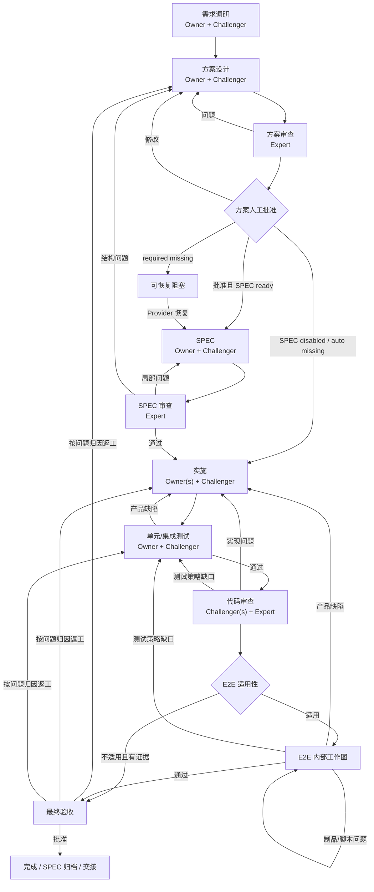

# Runtime v2 工作流演化审查

状态：设计验证完成，尚未实现。本文是 [`runtime-v2-architecture.md`](runtime-v2-architecture.md) 的非规范性验证报告，不定义 Workflow、角色、成本或恢复契约；出现差异时一律以架构文档和 [`AGENTS.md`](../AGENTS.md) 为准。本文记录一次性内存状态机原型的场景输入和结论；原型只用于发现设计问题，结论回写后删除，不属于生产源码。

## 1. 审查问题与方法

本轮回答五个问题：

1. 从任意阶段进入后，正常路径和返工分支能否在少量 Lead 动作下持续推进；
2. Owner、Challenger、Expert、Lead 和 Helper 是否各司其职，是否出现作者自审或审查递归；
3. `Junior:Senior:Expert = 1:10:50` 下，默认拓扑是否把 Expert 用在关键位置而不过度扩员；
4. 网关失败、宿主重启、会话失联、成本越界、人工拒绝和外部文件变化能否恢复；
5. 最终成果是否有足够的制品、独立复核和可验证证据，而非只依赖 Agent 声明。

原型使用与 Runtime v2 相同的十阶段、SPEC/E2E 分支、最多三轮、人工门禁和相对成本权重，执行了完整流程、局部 code-review、SPEC 缺失/恢复、测试返工、E2E 内部返工、成本暂停、三轮上限、最终拒绝以及网关崩溃恢复。

## 2. 修正后的主流程



局部任务不强制走完整图。`entryStage` 决定从哪里进入，`completion` 决定运行到哪个验收里程碑；例如已有代码的单独 Review 可以从 `code-review` 进入，在 Review 与 Expert 结论完成后直接进行 scoped final acceptance，不进入 E2E 或实施。entry/completion 创建后保持不可变；用户之后要求继续时创建引用既有制品的新任务并从下一实际阶段介入，避免改写已完成任务的审计含义。

## 3. 阶段、角色与基准成本

下表是用于验证的高质量默认拓扑，不是硬编码，也不是供应商账单。数字是单次正常通过、简单阶段规划、没有重试/Helper/额外轮次时的相对成本。

| 阶段 | 默认角色波次 | 关键成果 | 正常路径成本 |
| --- | --- | --- | ---: |
| research | Junior Owner → Senior Challenger | 需求理解、项目事实、未知项 | 11 |
| design | Senior Owner → Senior Challenger | 完整方案与风险 | 20 |
| design-review | 独立 Expert | 对方案事实与可行性的裁决；随后人工批准 | 50 |
| spec | Senior Owner → Senior Challenger | proposal/design/specs/tasks 或等价 SPEC | 20 |
| spec-review | 独立 Expert | SPEC 完整性、可执行性裁决 | 50 |
| implementation | 1–2 Junior Owner → Senior Challenger；必要时 integration Owner | 代码、实现说明、局部验证 | 12 起 |
| test | Junior Owner → Senior Challenger | 单元/集成测试与可验证结果 | 11 起 |
| code-review | 1–2 Senior Challenger 覆盖全部视角 → Expert | Review findings、Owner 回应、最终裁决 | 60–70 |
| e2e | Senior Owner → Senior Challenger → 核心/高风险 Expert | 用例、夹具、执行与结果证据 | 20–70 |
| finish | Runtime 投影 + 用户 | 最终交付摘要与人工决定 | 0 |

原型采用较高保障位，完整 SPEC + E2E 路径基准为 `314`；SPEC 与 E2E 都跳过时为 `174`。这说明：

- 该成本对完整、高保障研发任务合理，但不适合作为所有请求的统一默认；
- 局部任务、SPEC/E2E 显式路由和最低充分拓扑是主要降本手段；
- 大部分产出仍由 Junior/Senior 完成，Expert 每个核心审查点默认只使用一位；
- planning bootstrap、integration、额外证据和返工必须进入 Cost Ledger，否则实际成本会被系统性低估；
- 下一波超过 automatic limit 时必须先请求用户，而不是由 Lead 静默增加 Expert 或并发。

## 4. 角色推进是否闭环

每份产品、方案、SPEC 或测试制品遵循：

```text
Owner 理解与执行
  → Owner 自检并提交制品/证据
  → Challenger 独立找漏洞
  → Owner 接受修正或带证据反驳
  → 核心环节 Expert 裁决
  → 通过，或进入下一轮（最多三轮）
```

角色闭环成立，但必须遵守三个细节：

1. `assignment kind` 与 `TeamRole` 正交。代码 Review 通常由 Challenger/Expert 承担，不能把 Reviewer 固化成第四种角色；
2. Challenger 报告与 ExpertVerdict 是审查证据，不再递归创建 Challenger 审查它们；原 Owner 回应、Expert 裁决即可闭环；
3. 多 Owner 并行结果必须有 integration Owner；Lead 只掌握流程和分歧路由，不亲自合并代码、方案或测试结果。

Expert 既可以裁决，也可以在独立 assignment 中作为高成本 Owner 攻坚；一旦成为作者，就不能裁决同一制品。Helper 只向调用成员返回只读资料，不进入报告、评分或收敛链。

## 5. 分支与恢复演化结果

| 场景 | 期望演化 | 审查结果 |
| --- | --- | --- |
| 完整正常路径 | 两个人工门禁间由 Runtime 自动规划并推进 | 通过；Lead 不应逐阶段重复 PlanIntent |
| SPEC `auto + missing` | 记录跳过依据，方案批准后直达实施 | 通过 |
| SPEC `required + missing` | 保留有效方案批准，阻塞；Provider 恢复后进入 SPEC | 通过；不能要求用户重复批准未变化方案 |
| 单独 code-review | 只要求 source + review scope，Review 后局部验收 | 原设计缺 completion scope；已修正 |
| 方案修改/拒绝 | 回 design，新 stage run，旧 Expert/人工证据失效 | 通过 |
| SPEC 局部问题 | 回 spec；结构问题回 design 并重新方案批准 | 通过 |
| 测试发现产品缺陷 | 回 implementation，再依次重跑 test/code-review | 通过 |
| code-review 测试缺口 | 回 test；实现问题回 implementation | 通过 |
| E2E 路由 | Owner + 独立 Challenger 评估适用性/环境，Runtime 按 mode 和 evidence digest 决定 run/skip/block | 通过；用户强制或关键跨系统路径不可自动跳过 |
| E2E 制品问题 | 留在 E2E 内部 attempt；产品/策略问题分别回 implementation/test | 通过；需显式内部工作图 |
| 三轮未收敛 | 静止任务，请用户裁决或批准有限追加轮次 | 通过 |
| 成本将越界 | 在下一波派发前静止，请用户扩充预算、降级范围或停止 | 原设计成本信息不足；已增加 Cost Ledger |
| 网关错误后重启 | durable intent → inspect/reconcile → 续用原 execution，禁止重复派发 | 通过 |
| session 丢失 | 结构化 handoff 创建 successor execution，assignment 身份不变 | 通过 |
| 成员留下部分文件但无 report | 标记 unverified，交恢复 Owner 检查，不视为完成 | 已补充 |
| 用户/外部进程修改受管文件 | 保留外部变化，受影响 assignment stale，重新规划/询问 | 已补充 |
| 并行 Owner 写范围重叠 | 编译计划时拒绝；改为串行或 integration Owner | 已补充 |
| 人工等待期间晚到事件 | 持久化但不推进；用户决定后重新核对 evidence digest | 通过 |
| 最终验收拒绝 | 按方案、实现、测试、Review、E2E 归因回目标阶段 | 通过；后续证据按 stage run 失效 |
| OpenSpec archive 中断 | 保留最终批准，使用相同 operationId 恢复 archive | 通过 |

## 6. 成果可靠性

最终成果只有同时满足以下条件才可靠：

- Owner 的声明产物存在且未越出 writable refs；
- Owner 自检、Challenger 独立发现、Owner 回应和核心 ExpertVerdict 齐全；
- 测试/SPEC/人工结论使用 Runtime 注册的 EvidenceRecord，不能只凭自然语言声称通过；
- 平台支持时由 Hook/Adapter 记录关键 check receipt；不支持时必须独立复验或向用户暴露未验证风险；
- 产品制品 fingerprint 与审查、人工批准绑定，变化后旧结论自动失效；
- 方案批准保证实现方向与用户一致，最终验收保证实际结果被用户接受；
- 完整日志不回灌 Lead，但 ActionCard 和 DecisionPacket 能定位所有关键制品、证据、分歧和责任人。

这些机制能显著降低遗漏、模型幻觉、自审和流程误推进，但不能证明业务绝对正确。残余风险主要来自错误需求、无法构造的环境、多个模型的相关性偏差和平台无法观测的外部操作；它们必须作为风险显式呈现，而不是由 Runtime 伪造确定性。

## 7. 最终结论与实施门槛

修正 completion scope、TaskIntent 跨阶段继承、Review 非递归闭环、Cost Ledger、EvidenceRecord 和 E2E 内部工作图后，Runtime v2 的主流程是顺畅且可闭环的：Lead 正常只需首次 `open/plan`、按 ActionCard `run`，在方案批准、最终验收、真实业务分支、成本越界或三轮未收敛时 `steer`。

当前没有阻止实现的架构级死路，但以下内容必须先成为契约测试，才能认为实现达到设计预期：

1. full workflow、through-stage 和任意 entryStage 的路径枚举；
2. 每条返工边的最低输入预检、stage run 重开和后续证据失效；
3. Owner/Challenger/Expert 独立性、产品写权限和 Review 非递归；
4. SPEC 三模式、E2E 内部图和最终归档恢复；
5. 成本预留/消耗/越界、三轮上限和第二 Expert；
6. check receipt、artifact digest、Provider 与真实用户证据等级；
7. 网关 in-doubt、重启、session lost、部分文件、外部修改和并行写冲突。

原型只证明状态模型可以表达这些路径，不证明生产 Implementation 已完成；真正验收仍需 Fake Adapter 故障矩阵和 OpenCode 低成本真实 E2E。

## 8. 最终交叉审查

本设计分别按 Standards 和 Spec/架构目标两个独立视角审查。首轮发现并修正了 Roadmap 状态/事实源重复、SPEC 三模式路由、SPEC 外部副作用恢复、standalone 人工决定凭证、completion 可达性和 E2E 显式路由。修正后由原审查者复审，两轴均为 `0 findings`，没有残留 P0–P3 设计问题。

结论：设计仍满足最初的 Lead 轻量控制面、Runtime 唯一状态、任意阶段介入、Owner/Challenger/Expert 质量闭环、成本可控、异常可恢复和跨平台适配目标；四个 Product Module 的边界和依赖方向未被修正项破坏。
